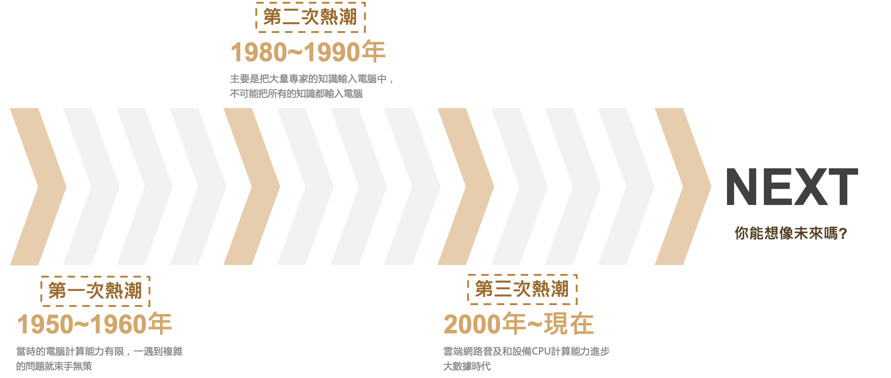
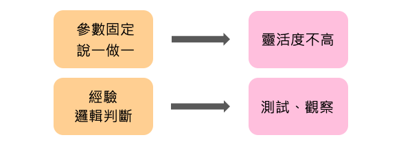
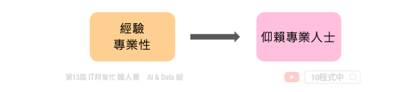
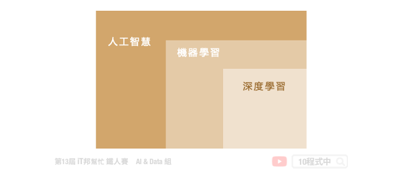
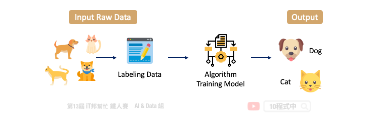
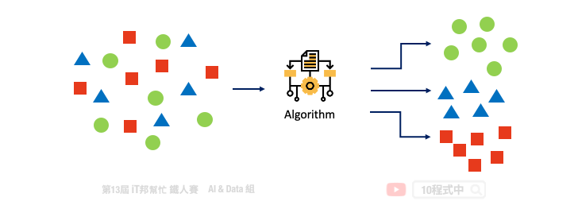
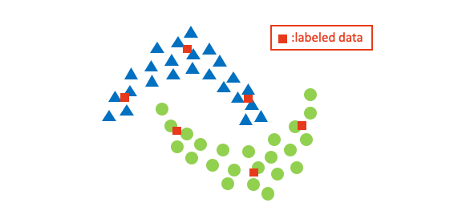
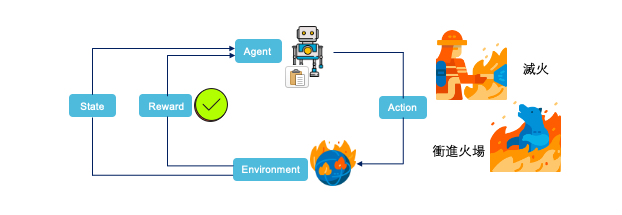
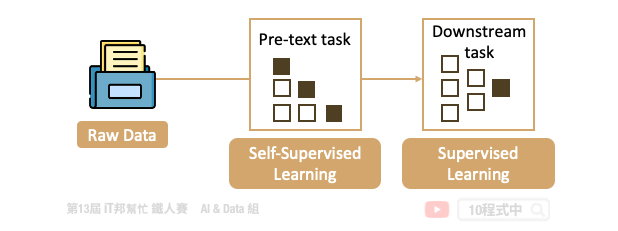
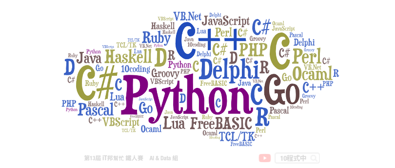

# 快來探索AI的世界
## Day 2 學習目標
- 人工智慧的演進
- 人工智慧的分級
- 機器是如何學習的

## 人工智慧的演進
AI 與機器學習技術正在蓬勃發展中，你能想像人工智慧曾被認為是一個毫無出路的領域嗎? 從人工智慧的時間軸來看可以分為三個熱潮。第一次熱潮（1950~1960年），由於早期的電腦硬體資源的不足導致複雜的問題無法輕易的解決。第二次熱潮（1980~1990年）將帶有知是本體的代理人放入機器人中使具有智慧，也就是所謂的專家系統。但人類資源有限不可能把所有的知識都逐一地輸入到電腦。因此大家開始思考機器是否能夠讓他自己去學習？而不是人類一昧的餵入這些知識。第三次熱潮（2000年~現在）由於 CPU、GPU 以及雲端運算資源普及，早期複雜難解的演算法陸續可以透過超級電腦來解決。當手邊有了大量的數據就能拿來機器學習，因此大家踏入了大數據以及深度學習的時代。時間不斷的往前走，你能想像未來的 AI 在世界上是扮演什麼樣的角色嗎？

## 人工智慧的分級
現今人工智慧與我們生活無所不在，例如我們只要對著手機喊一聲「Hey Siri !」蘋果手機的語音助理就能幫你打理好大小事。或者正在超市購物的你正在為購買哪一項商品煩惱時，推薦系統機器人能夠即時地為你做商品推薦。看似著簡單的動作，但人工智慧的情景在你我日常生活中息息相關。人工智慧依照機器能夠處理與判斷的能力區分為四個分級，分別為自動控制、探索推論、機器學習、深度學習：

### 第一級人工智慧：自動控制
機器含有自動控制的功能，並且經由感測器偵測環境的資訊。例如透過溫度感測器來偵測產線的馬達是否過熱，並達到停止運轉效果。或是冷氣低於20度時就進入待機模式……等。因此程式設計師必須先把所有可能的情況都考慮進去才能寫出控制程式。這就衍伸出一些問題，像是靈活度不高，且需要有經驗的專家介入才能完成。

### 第二級人工智慧：探索推論
第二級逐漸開始強調邏輯推理，可以說是補足第一級的問題。透過將知識組織成知識本體並讓機器從現有的資訊中去推理。典型的例子就是專家系統，它是透過特定領域的專家訂定出一套知識庫與規則庫，並產生大量輸入與輸出資料的排列組合來解決日常生活中的問題。當然所謂的專家系統就必須邀請領域的專家為系統量身打造一套獨一無二的規則。然而每個人的觀點可能都不同，因此不同專家間所制定的規則可能都不太一樣。

### 第三級人工智慧：機器學習
機器可以根據資料學習如何將輸入與輸出資料產生關聯。機器學習是一種學習的演算法，並從資料中去學習並找出問題的解決方法。其應用包括搜尋引擎、大數據分析等。我們依據資料與學習方式可大致分為監督式學習、非監督式學習、增強式學習，此外自監督學習這個名詞最近也熱烈的討論中。

### 第四級人工智慧：深度學習
深度學習是一種機器學習的方法。它藉由模仿人類大腦神經元的結構，定義解決問題的函式。所謂深度學習是一種具有深度多層的神經網路。機器可以自行學習並且理解機器學習時用以表示資料的「特徵」，因此又稱為「特徵表達學習」，其應用包括：影像分類、機器翻譯...等。

## 機器如何學習？
### 監督式學習 (Supervised Learning)
所謂的監督式學習是給許多資料並給與答案，透過損失函數計算來找出一個最佳解。舉一個簡單的例子，比如給機器各看了 1000 張貓和狗的照片後再詢問機器新的一張照片中是貓還是狗。一直不斷的迭代訓練並從錯誤中去學習，最終機器能成功的分類了。

### 非監督式學習 (Unsupervised Learning)
非監督式學習只給定特徵，機器會想辦法會從中找出規律。非監督式學習最常見的方法就是集群分析(Cluster Analysis)，目標是根據特徵將資料樣本分為幾群。簡單來說非監督式學習就是給許多資料但不給予答案，模型會從資料中自己去找出關係。透過分群演算法來計算資料與資料間的相似程度與距離。

### 半監督式學習 (Semi-Supervised Learning)
介於監督式學習與非監督式學習之間。在現實生活中，未標記樣本多、有標記樣本少是一個比價普遍現象，如何利用好未標記樣本來提升模型泛化能力，就是半監式督學習研究的重點。半監式督學習的應用主要在於收集資料很簡單，但標記的資料太少了，我們希望可以自動標記資料。

### 強化式學習 (Reinforcement Learning)
在強化式學習中機器會進行一系列的動作，而每做一個動作、環境都會跟著發生變化。若環境的變化是離目標更接近，我們就會給予一個正向反饋。若離目標更遠，則給予負向反饋。機器透過不斷的從錯誤中去學習，最終學到了如何去解決一件事情。

### 自監督學習 (Self-Supervised Learning)
自監督學習是由卷積神經之父 Yann LeCun 於 2019 年所提出來的一種學習機制。此學習機制模仿模仿人類的學習行為，透過當前任務觀察所得到的特徵，並訓練一個目標任務的模型。而且學習過程中並不仰賴人類給定的標籤。簡單來說訓練過程是拿一個訓練好的模型透過非監督式技巧 pre-text task 訓練好模型，訓練完成後再接到下游任務做最後的模型微調 (fine tune)。

## 學 AI 該用哪種程式語言？
Python 是近年來高速成長並且逐漸普及的程式語言，也可以說是最容易上手的程式語言之一。主要在於它的語法是簡化而不複雜的，同時強調程式碼的可讀性因此更能貼近程式設計者的思維。當然也些人使用 R 語言進行統計分析、繪圖以及資料探勘甚至建模。如果你正在猶豫要入坑哪一類程式語言，筆者這裡推薦 Python 程式語言。因為 Python 不僅可以進行資料分析、機器學習也能進行前/後端開發。另外 Python 有豐富的討論社群以及許多開源套件支援，大幅的降低學習門檻。

說了這麼多！大家準備好了嗎？快準備好電腦與筆記本，好好的為自己進行三十天的充電吧～ Let's Go!

本系列教學內容都可以從我的 [GitHub](https://github.com/andy6804tw/2021-13th-ironman) 取得！