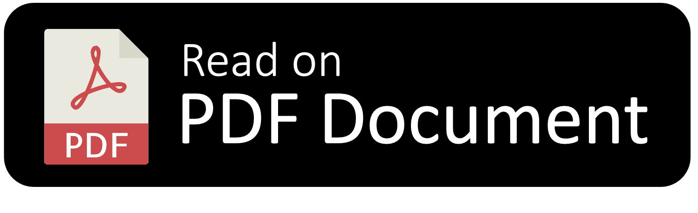
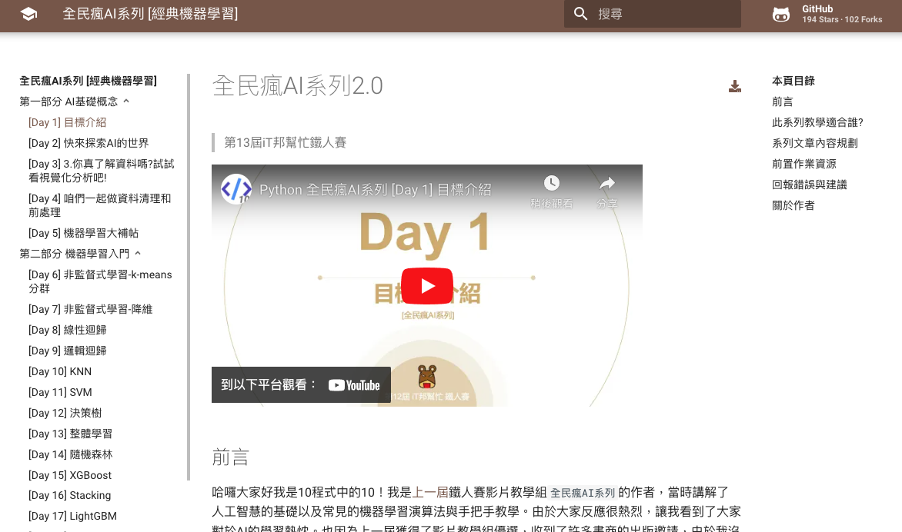
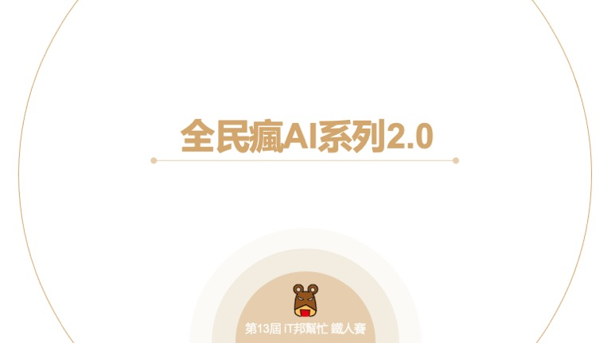

# 全民瘋AI系列 [經典機器學習]

  

📢 **[新影片](https://youtu.be/9nbd4tsF1Hc?si=1kVuarOGWXBlDAVu) 機器學習教學 2026｜3 小時零基礎 AI 入門｜Python 應用｜新手友善**

> 第13屆iT邦幫忙鐵人賽

<table>
    <tr>
        <td>
            
        </td>
        <td>
            
📢 <strong>歡迎購書支持！</strong> 🎉

            
本書改寫自 <strong>「第12屆iT邦幫忙鐵人賽 全民瘋AI系列」</strong>，在原有的內容基礎上，增添 <strong>十三種經典實務範例</strong>，並強化 <strong>模型部署實作</strong>，讓讀者能更全面掌握 AI 技術的實際應用。

            
從基礎機器學習演算法入門，本書循序漸進解析 AI 技術，涵蓋 <strong>資料處理、模型構建、優化與部署</strong>，並提供豐富的 <strong>Python 範例</strong> 與 <strong>實務應用</strong>，讓讀者不僅理解理論，更能將 AI 技術應用於實際場景。

            
如果你喜歡我的創作 ❤️，歡迎 <a href="https://www.tenlong.com.tw/products/9786267569511" target="_blank"><strong>購買書籍</strong></a> 作為支持！🙏你的支持將成為我持續開源與分享更多 AI 相關內容的動力！

            
<a href="https://youtu.be/fbx0SyRebfM"><strong>新書主題曲🎶</strong></a>

        </td>
    </tr>
</table>

## 《全民瘋 AI 系列 ‐ 經典機器學習》書籍勘誤與內容更新
感謝您購買《全民瘋 AI 系列 - 經典機器學習》。雖然在出版過程中，書稿已經過多次校對與覆閱，但仍難免會有疏漏或錯誤。另外，由於 scikit-learn 等資料科學套件更新速度相當快，我也會在本網站適時提供相關內容的補充與修正資訊。

👉 **完整勘誤與更新內容請參考：**
🔗 [《全民瘋 AI 系列 ‐ 經典機器學習》書籍勘誤與內容更新（Wiki）](https://github.com/andy6804tw/crazyai-ml/wiki/%E3%80%8A%E5%85%A8%E6%B0%91%E7%98%8B-AI-%E7%B3%BB%E5%88%97-%E2%80%90-%E7%B6%93%E5%85%B8%E6%A9%9F%E5%99%A8%E5%AD%B8%E7%BF%92%E3%80%8B%E6%9B%B8%E7%B1%8D%E5%8B%98%E8%AA%A4%E8%88%87%E5%85%A7%E5%AE%B9%E6%9B%B4%E6%96%B0)

若您在閱讀過程中發現任何問題或錯誤，誠摯邀請您透過「[issue回報](https://github.com/andy6804tw/crazyai-ml/issues)」告訴我。非常感謝您的寶貴意見，我將會根據回報內容盡快更新「勘誤表」。

## 公告

  
📢 [2026/01] 🎬 即將推出《經典機器學習》入門導讀影片，敬請期待

  
📢 [2025/12] 📘 新增《經典機器學習》書籍<a href="https://github.com/andy6804tw/crazyai-ml/wiki/%E3%80%8A%E5%85%A8%E6%B0%91%E7%98%8B-AI-%E7%B3%BB%E5%88%97-%E2%80%90-%E7%B6%93%E5%85%B8%E6%A9%9F%E5%99%A8%E5%AD%B8%E7%BF%92%E3%80%8B%E6%9B%B8%E7%B1%8D%E5%8B%98%E8%AA%A4%E8%88%87%E5%85%A7%E5%AE%B9%E6%9B%B4%E6%96%B0">勘誤總表</a>

  
📢 [2025/02] ✨此系列出版實體書籍囉！

  
2/19 前預購 7.9 折優惠！ 🎉

            
本書改寫自 <strong>「第12屆iT邦幫忙鐵人賽 全民瘋AI系列」</strong>，在原有的內容基礎上，增添 <strong>十三種經典實務範例</strong>，並強化 <strong>模型部署實作</strong>，讓讀者能更全面掌握 AI 技術的實際應用。

            
從基礎機器學習演算法入門，本書循序漸進解析 AI 技術，涵蓋 <strong>資料處理、模型構建、優化與部署</strong>，並提供豐富的 <strong>Python 範例</strong> 與 <strong>實務應用</strong>，讓讀者不僅理解理論，更能將 AI 技術應用於實際場景。

            
如果你喜歡我的創作 ❤️，歡迎<a href="https://www.tenlong.com.tw/products/9786267569511" target="_blank"><strong>購買書籍</strong></a>作為支持！🙏 你的支持將成為我持續開源與分享更多 AI 相關內容的動力！

  
📢 [2025/01] 電子書新增ChatBot🤖學習小助手 

  > 點選網頁右下角 icon 即可免費快速詢問此系列電子書內容。

  
📢 [2024/09] 此系列新增<a href="podcasters.spotify.com/pod/show/10413/episodes/Ep-1-Your-Journey-Begins-Here-e2obnbm/a-abhb0dn">英文版Podcast</a>！ 

  無論是上學或上班途中，讓我們陪伴你一起展開新的學習旅程！
  我們很高興宣布，此系列節目已新增英文版Podcast，適合想加強英文聽力或喜歡用英文學習的朋友們！
  > 此Podcast內容由生成式AI產生，因此在某些情況下，可能會提供不完全準確的資訊。

##### 快速收聽 ⬇
- [Soptify平台](https://podcasters.spotify.com/pod/show/10413/episodes/Ep-1-Your-Journey-Begins-Here-e2obnbm/a-abhb0dn)

  
📢 [2024/08] 此系列新增電子書版本～ 全民瘋AI系列 [經典機器學習]

  提供方便的學習平台，匯集影片與文章形式。
##### 傳送門 ⬇
- [電子書(免費版)](https://andy6804tw.github.io/crazyai-ml/1.%E5%85%A8%E6%B0%91%E7%98%8BAI%E7%B3%BB%E5%88%972.0%E7%9B%AE%E6%A8%99%E4%BB%8B%E7%B4%B9/)

  
📢 [2023/09] 新內容連載！ 2023 iThome 鐵人賽 揭開黑箱模型：探索可解釋人工智慧

  大家好！我有個好消息要告訴大家。今年我參加了2023年第15屆iT幫鐵人賽的AI&Data組，我的主題是「揭開黑箱模型：探索可解釋人工智慧」，這是全民瘋AI系列的進階篇。在新的系列本系列將從 XAI 的基礎知識出發，深入探討可解釋人工智慧在機器學習和深度學習中的應用、案例和挑戰，以及未來發展方向。有興趣朋友歡迎點選下面連結前來iT幫支持與訂閱。
##### 傳送門 ⬇
- [2023 iThome 鐵人賽 揭開黑箱模型：探索可解釋人工智慧](https://ithelp.ithome.com.tw/users/20107247/ironman/6272)

電子書： https://andy6804tw.github.io/2021-13th-ironman/

## 全民瘋AI系列電子書 (免費開源版)
全民瘋AI系列 是一個專為 AI 學習資源打造的開源平台，由一群熱愛資料科學的工程師所創立。這個平台的宗旨是提供一個開放、協作的環境，讓更多人能夠方便地學習 AI 和機器學習相關技術，無論是初學者還是進階使用者，都可以在這裡找到適合的學習資源和工具。透過社群的力量，平台上的內容持續更新，涵蓋從基礎理論到實務應用，滿足不同層次的學習需求。

| 書名                            | 簡介                              | 完成進度  | 討論區連結 |
|---------------------------------|-----------------------------------|-----------|------------|
| [Python從零開始](https://andy6804tw.github.io/crazyai-python/)| 適合初學者，詳細介紹Python語言的基本概念與程式設計技巧。 | 30%      | [加入討論](https://github.com/andy6804tw/crazyai-python/issues) |
| [經典機器學習](https://andy6804tw.github.io/crazyai-ml/)| 涵蓋各種經典的機器學習模型與演算法，從理論到實踐。         | 100%       | [加入討論](https://github.com/andy6804tw/crazyai-ml/issues) |
| [探索可解釋人工智慧](https://andy6804tw.github.io/crazyai-xai/)| 介紹解釋AI模型的最新技術與方法，幫助讀者理解AI決策的背後原因。 | 100%       | [加入討論](https://github.com/andy6804tw/crazyai-xai/issues) |
| [深度學習與神經網路](https://andy6804tw.github.io/crazyai-dl/)| 深入介紹深度學習與神經網路的概念與實作，適合進階讀者。       | 20%       | [加入討論](https://github.com/andy6804tw/crazyai-dl/issues) |
| [深度強化學習](https://andy6804tw.github.io/crazyai-rl/)| 涵蓋深度強化學習的理論與應用，適合對最佳化有深入興趣的讀者。   | 10%       | [加入討論](https://github.com/andy6804tw/crazyai-rl/issues) |
| [大語言模型應用與實戰](https://andy6804tw.github.io/crazyai-llm/)|  探討 LLM 基礎、微調與應用，透過實作輕鬆上手打造專屬 AI 機器人。   | 10%       | [加入討論](https://github.com/andy6804tw/crazyai-llm/issues) |

#### 鐵人賽列表
| 文章 | 程式 |
| ------------- | ------------- |
| [[Day 1] 全民瘋AI系列2.0-機器學習實戰手冊](https://ithelp.ithome.com.tw/articles/10263409) | -  |
| [[Day 2] 快來探索AI的世界](https://ithelp.ithome.com.tw/articles/10263822) | -  |
| [[Day 3] 你真了解資料嗎?試試看視覺化分析吧!](https://ithelp.ithome.com.tw/articles/10264416) | [Code](https://colab.research.google.com/github/andy6804tw/2021-13th-ironman/blob/main/docs/3.你真了解資料嗎試試看視覺化分析吧/3.你真了解資料嗎試試看視覺化分析吧.ipynb)  |
| [[Day 4] 咱們一起做資料清理和前處理](https://ithelp.ithome.com.tw/articles/10265253) | [Code](https://colab.research.google.com/github/andy6804tw/2021-13th-ironman/blob/main/docs/4.咱們一起做資料清理和前處理/4.咱們一起做資料清理和前處理.ipynb)  |
| [[Day 5] 機器學習大補帖](https://ithelp.ithome.com.tw/articles/10265942) | - |
| [[Day 6] 非監督式學習 K-means 分群](https://ithelp.ithome.com.tw/articles/10266672) | [Code](https://colab.research.google.com/github/andy6804tw/2021-13th-ironman/blob/main/docs/6.非監督式學習k-means分群/6.非監督式學習k-means分群.ipynb) |
| [[Day 7] 非監督式學習-降維](https://ithelp.ithome.com.tw/articles/10267685) | [Code](https://colab.research.google.com/github/andy6804tw/2021-13th-ironman/blob/main/docs/7.非監督式學習-降維/7.非監督式學習-降維.ipynb) |
| [[Day 8] 線性迴歸 (Linear Regression)](https://ithelp.ithome.com.tw/articles/10268453) | [Code](https://colab.research.google.com/github/andy6804tw/2021-13th-ironman/blob/main/docs/8.線性迴歸/8.線性迴歸.ipynb) |
| [[Day 9] 邏輯迴歸 (Logistic Regression)](https://ithelp.ithome.com.tw/articles/10269006) | [Code](https://colab.research.google.com/github/andy6804tw/2021-13th-ironman/blob/main/docs/9.邏輯迴歸/9.邏輯迴歸.ipynb) |
| [[Day 10] 近朱者赤，近墨者黑 - KNN](https://ithelp.ithome.com.tw/articles/10269826) | [KNN(Classification)](https://colab.research.google.com/github/andy6804tw/2021-13th-ironman/blob/main/docs/10.KNN/10.1.KNN(Classification-iris).ipynb)、[KNN(Regression)](https://colab.research.google.com/github/andy6804tw/2021-13th-ironman/blob/main/docs/10.KNN/10.2.KNN(Regression).ipynb) |
| [[Day 11] 核模型 - 支持向量機 (SVM)](https://ithelp.ithome.com.tw/articles/10270447) | [SVM(Classification)](https://colab.research.google.com/github/andy6804tw/2021-13th-ironman/blob/main/docs/11.SVM/11.1.SVM(Classification-iris).ipynb)、[SVR(Regression)](https://colab.research.google.com/github/andy6804tw/2021-13th-ironman/blob/main/docs/11.SVM/11.2.SVR(Regression).ipynb) |
| [[Day 12] 決策樹 (Decision tree)](https://ithelp.ithome.com.tw/articles/10271143) | [決策樹(Classification)](https://colab.research.google.com/github/andy6804tw/2021-13th-ironman/blob/main/docs/12.決策樹/12.1.決策樹(Classification-iris).ipynb)、[決策樹(Regression)](https://colab.research.google.com/github/andy6804tw/2021-13th-ironman/blob/main/docs/12.決策樹/12.2.決策樹(Regression).ipynb) |
| [[Day 13] 整體學習 (Ensemble Learning)](https://ithelp.ithome.com.tw/articles/10271882) | - |
| [[Day 14] 多棵決策樹更厲害：隨機森林 (Random forest)](https://ithelp.ithome.com.tw/articles/10272586) | [隨機森林(Classification)](https://colab.research.google.com/github/andy6804tw/2021-13th-ironman/blob/main/docs/14.隨機森林/14.1.隨機森林(Classification-iris).ipynb)、[隨機森林(Regression)](https://colab.research.google.com/github/andy6804tw/2021-13th-ironman/blob/main/docs/14.隨機森林/14.2.隨機森林(Regression).ipynb) |
| [[Day 15] 機器學習常勝軍 - XGBoost](https://ithelp.ithome.com.tw/articles/10273094) | [XGBoost(Classification)](https://colab.research.google.com/github/andy6804tw/2021-13th-ironman/blob/main/docs/15.XGBoost/15.1.XGBoost(Classification-iris).ipynb)、[XGBoost(Regression)](https://colab.research.google.com/github/andy6804tw/2021-13th-ironman/blob/main/docs/15.XGBoost/15.2.XGBoost(Regression).ipynb) |
| [[Day 16] 每個模型我全都要 - 堆疊法 (Stacking)](https://ithelp.ithome.com.tw/articles/10274009) | [Code](https://colab.research.google.com/github/andy6804tw/2021-13th-ironman/blob/main/docs/16.Stacking/16.house-price-prediction-stacking.ipynb) |
| [[Day 17] 輕量化的梯度提升機 - LightGBM](https://ithelp.ithome.com.tw/articles/10274577) | [Code](https://colab.research.google.com/github/andy6804tw/2021-13th-ironman/blob/main/docs/17.LightGBM/17.creditcard-fraud-detection-lightgbm.ipynb) |
| [[Day 18] 機器學習 boosting 神器 - CatBoost](https://ithelp.ithome.com.tw/articles/10275263) | [Code](https://colab.research.google.com/github/andy6804tw/2021-13th-ironman/blob/main/docs/18.CatBoost/18.CatBoost(house_prices).ipynb) |
| [[Day 19] 自動化機器學習 - AutoML](https://ithelp.ithome.com.tw/articles/10275842) | - |
| [[Day 20] 機器學習金手指 - Auto-sklearn](https://ithelp.ithome.com.tw/articles/10276333) | [Code](https://colab.research.google.com/github/andy6804tw/2021-13th-ironman/blob/main/docs/20.Auto-Sklearn/20.Auto-sklearn(iris-classification).ipynb) |
| [[Day 21] 調整模型超參數利器 - Optuna](https://ithelp.ithome.com.tw/articles/10276835) | [Code](https://colab.research.google.com/github/andy6804tw/2021-13th-ironman/blob/main/docs/21.Optuna/21.optuna-tutorial.ipynb) |
| [[Day 22] Python 視覺化解釋數據 - Plotly Express](https://ithelp.ithome.com.tw/articles/10277258) | [Code](https://colab.research.google.com/github/andy6804tw/2021-13th-ironman/blob/main/docs/22.Plotly-Express/22.Plotly-Express.ipynb) |
| [[Day 23] 資料分布與離群值處理](https://ithelp.ithome.com.tw/articles/10278000) | [Code](https://colab.research.google.com/github/andy6804tw/2021-13th-ironman/blob/main/docs/23.資料分布與離群值處理/23.資料分布與離群值處理.ipynb) |
| [[Day 24] 機器學習 - 不能忽視的過擬合與欠擬合](https://ithelp.ithome.com.tw/articles/10278254) | - |
| [[Day 25] 交叉驗證 Cross-Validation 簡介](https://ithelp.ithome.com.tw/articles/10278851) | - |
| [[Day 26] 交叉驗證 K-Fold Cross-Validation](https://ithelp.ithome.com.tw/articles/10279240) | - |
| [[Day 27] 機器學習常犯錯的十件事](https://ithelp.ithome.com.tw/articles/10279778) | - |
| [[Day 28] 儲存訓練好的模型](https://ithelp.ithome.com.tw/articles/10280076) | [Code](https://colab.research.google.com/github/andy6804tw/2021-13th-ironman/blob/main/docs/28.儲存訓練好的模型/28.XGBoost(Classification-iris).ipynb) |
| [[Day 29] 使用 Python Flask 架設 API 吧！](https://ithelp.ithome.com.tw/articles/10280422) | [Code](https://github.com/andy6804tw/2021-13th-ironman/tree/main/29.使用Python-Flask架設API吧/Flask-API-example-with-ML-model) |
| [[Day 30] 使用 Heroku 部署機器學習 API](https://ithelp.ithome.com.tw/articles/10280857) | [Code](https://github.com/1010code/Flask-API-example-with-ML-model-heroku) |

## 前言
哈囉大家好我是10程式中的10！我是[上一屆](https://ithelp.ithome.com.tw/users/20107247/ironman/3719)鐵人賽影片教學組`全民瘋AI系列`的作者，當時講解了人工智慧的基礎以及常見的機器學習演算法與手把手教學。由於大家反應很熱烈，讓我看到了大家對於AI的學習熱忱。也因為上一屆獲得了影片教學組優選，收到了許多書商的出版邀請，由於我沒有時間與動力將這些大量知識寫成文章因此都婉拒了。因此我想藉由這一次鐵人賽將上一屆的影片內容整理成電子書版本，提供大家影片教學與文字版的筆記內容(唷呼書商快看過來～)當然內容會以之前影片教學為基底，並加入一些新的元素讓文章內容變得更紮實。在全新的`全民瘋AI系列2.0`中我會介紹實用的機器學習演算法並含有程式手把手實作，以及近年來熱門的機器學習套件與模型調參技巧。除此之外我還會提到大家最感興趣的 AI 模型落地與整合。希望在這次的鐵人賽能夠將AI的資源整理得更詳細並分享給各位。

## 此系列教學適合誰?
如果您是之前的舊讀者，歡迎回來為自己充電～新的系列文章保證讓你收穫滿滿！若您是新來的讀者歡迎加入人工智慧的世界，此系列文章正適合初學者閱讀。另外建議可以搭配我[上一屆](https://ithelp.ithome.com.tw/users/20107247/ironman/3719)鐵人賽的影片教學進行學習。

## 系列文章內容規劃
在本次鐵人賽預計新增了許多新內容，特別是近年來比較新的演算法套件，以及在模型訓練中必須注意的大小事。本系列要在短短30天內講完所有 AI 領域相關應用是不太可能的事情，因此我的規劃是從認識人工智慧開始切入主題。先讓大家知道何謂人工智慧以及相關應用有哪些。接著帶各位了解成為資料科學家的第一步，就是資料分析與視覺化，再來會有一系列經典的機器學習演算法介紹。最後也是大家可能會有興趣的整合部分，會以實際的帶大家手把手部署我們的AI模型以及前後端串接的概念。

## 前置作業資源
本系列教學將有大量的程式實作，並採用 Google Colab 做為程式雲端運行的編輯執行環境。各位可以直接利用 Colab 開啟本系列文章的範例程式。在使用此平台之前每個人都必須要有自己的 Google 帳號，才能順利的開啟並執行程式碼。Colab 可讓你輕鬆地在瀏覽器上撰寫並執行 Python 程式語言，它可以說是機器學習新手的入門工具。此外 Colab 具備了以下幾個優點：

- 不必進行任何設定與安裝
- 免費額度使用 GPU、TPU 資源
- 輕鬆共用與分享檔案

因此讀者必須先熟悉 Colab 的操作模式，想了解該如何操作的朋友們可以先來看這部[影片](https://youtu.be/C9mvGMtrPXo?t=266)教學。

## 回報錯誤與建議
本系列文章若有問題或是內容建議都可以來 GitHub 中的 [issue](https://github.com/andy6804tw/2021-13th-ironman/issues) 提出。歡迎大家一同貢獻為這系列文章有更好的閱讀品質。

## 關於作者
曾任職於台灣人工智慧學校，擔任AI工程師，擁有豐富的教學經驗，熱衷於網頁前後端整合與AI演算法的開發。希望藉由鐵人賽，將所學貢獻出來，為AI領域提供更多資源。

[@andy6804tw](https://github.com/andy6804tw)

歡迎大家訂閱我的 [YouTube](https://www.youtube.com/channel/UCSNPCGvMYEV-yIXAVt3FA5A) 頻道。

本系列教學內容都可以從我的 [GitHub](https://github.com/andy6804tw/2021-13th-ironman) 取得！
