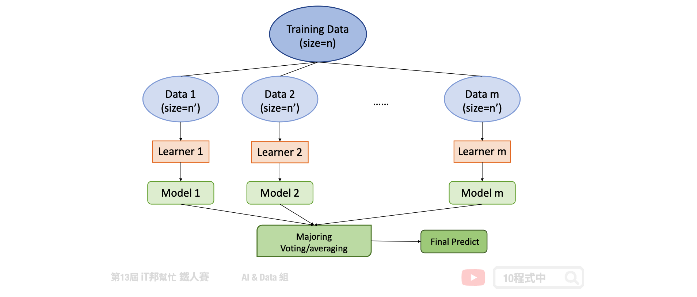
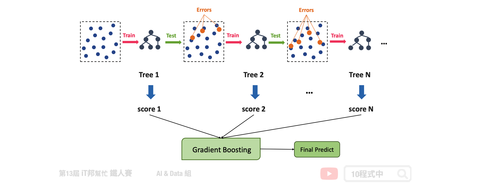
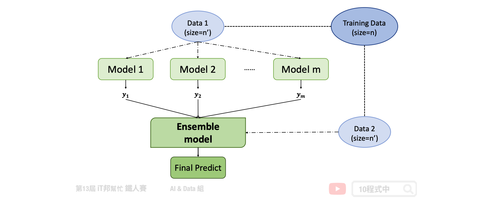
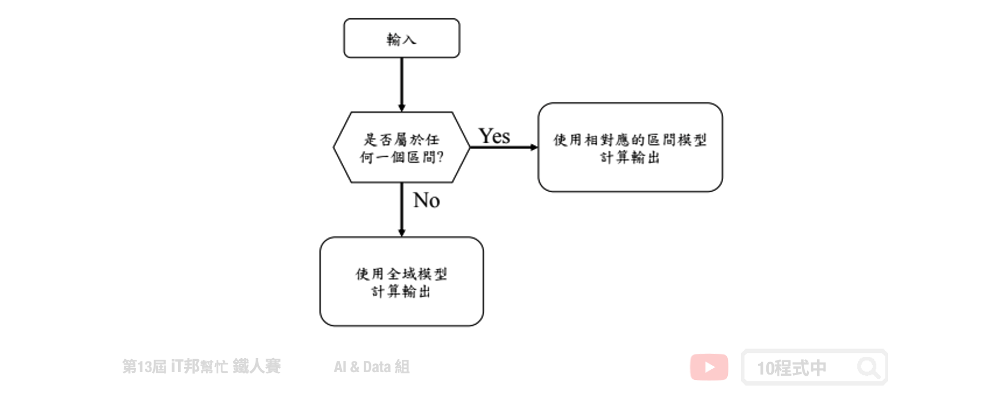

# 整體學習 (Ensemble Learning)

## 今日學習目標
- 了解整體學習
    - 何謂整體學習？
- 三種不同的整體學習
    - Bagging、Boosting、Stacking
    
<iframe width="560" height="315" src="https://www.youtube.com/embed/" frameborder="0" allow="accelerometer; autoplay; clipboard-write; encrypted-media; gyroscope; picture-in-picture" allowfullscreen></iframe>

## 何謂整體學習？
整體學習 (Ensemble Learning) 又稱集成學習、整合學習，指的是以一個系統化的方式將好幾個監督式學習的模型結合在一起，目的是希望結合眾多的模型產生一個更強大的模型。在許多科學競賽中 Ensemble Learning 在實務上是非常有效的提升預測準確率。依照 Ensemble 的處理方式的不同，我們可以將它分為三類。第一類為 Bagging，第二類為 Boosting，第三類為 Stacking。

- Bagging:
    - Random forest
- Boosting:
    - AdaBoost
    - Gradient Boosting 
    - XGBoost
- Stacking

## Bagging 自助重抽總合法
Bagging 指的是我們把訓練資料重新採樣產生不同組的訓練資料，如下圖為整體學習 Bagging 之架構。根據不同組的訓練資料即使我們用同一種演算法我們也會得到不一樣的模型，他的樹是各自獨立因此可以平行化處理。代表的方法是隨機森林，隨機森林除了 Bagging 之外，還有另一個隨機的因素是每一棵樹都只能看到一部分的特徵，這些特徵是由隨機決定的。

## Boosting 推升法
Boosting 則會根據每一筆訓練資料的難或簡單給予不同的權重。如下圖所示，首先我們會訓練一個 base learner 然後根據 base learner 預測的結果對或錯來分辨該筆資料是一個簡單還是困難的資料。對於難的資料我們加強他的權重再訓練一個新的分類器或迴歸器。我們目標是希望訓練後，新的模型在這些難的資料能夠表現得更好。我們不斷重複這些步驟，不斷地加入新的 base learner，且新的 base learner 把過去表現不好的地方改善，這就是 Boosting 精神。因此 Boosting 的每一棵樹是互相有關聯性的做完第一棵樹可能進行下一棵樹的生成。代表的方法有 AdaBoost、Gradient Boosting，兩種都是產生非常多棵的樹，但是每一棵都是很簡單的決策樹。Boosting 目標是希望新的樹可以針對舊的樹預測不太好的部分做一些補強。所以最終我們要把這麼多簡單的樹合再一起才能當最後的預測。

## Stacking 堆疊法
下圖為整體學習 Stacking 架構。Stacking 首先產生出 m 個模型，彼此間並互相無關連，例如第一個模型為 logistic regression 第二個為決策樹。訓練完 m 個模型後，我們要把這 m 個模型合併在一起。合併的方式是我們再另外訓練一個模型，這個模型把m個模型的輸出當成新的模型的輸入因此我們會根據這m個特徵利用整體學習其中的演算法來學習一個模型並預測最終結果。

---

## 區域學習 (Patch Learning)
區域學習 ([Patch Learning](https://arxiv.org/abs/1906.00158) , PL) 於 2019 年由美國南加州大學 Jerry M. Mendel 與 Dongrui Wu 所提出的一種機器學習方法。所謂的區域學習是能夠有效的掌握表現不好的區間，經過訓練一個全域的模型後並任一機器學習模型找出這些誤差大的 Patch，透過多個斷點的學習我們會得到 Global Model、Patch1 Model、Patch2 Model…Patch(n) Model。然而在機器學習中我們有很多種方法可以改善我們的模型，例如加深和加寬神經網路或是添加一些非線性的激勵函數來最佳化我們的模型。或是使用整體學習的方法集合許多策略，最終形成一個強學習器並改善某些區域的弱點。下圖為一個簡單的區域學習預測流程圖。在使用區域學習模型前我們要找出該段輸入所對應的 Patch，若該區間剛好落於所劃定的範圍內，這些輸入就將會對應到相對應的區域學習，否則就會使用全域模型進行預測。

區域學習機制包括三個部分，簡要說明如下: (1)使用所有訓練資料訓練一個全域模型; (2)挑出影響錯誤率較高的資料，再放入個別的 Patch 模型進行區域訓練; (3)自訓練資料中去掉已經被局部模型用過的資料，再使用剩下的所有資料更新全域模型。當輸入資料進來時，首先判斷這個輸入是不是在剛剛記下的 Patch 模型中，如果是的話，就執行 Patch 模型。如果不是的話，執行更新後的全域模型。

本系列教學內容及範例程式都可以從我的 [GitHub](https://github.com/andy6804tw/2021-13th-ironman) 取得！