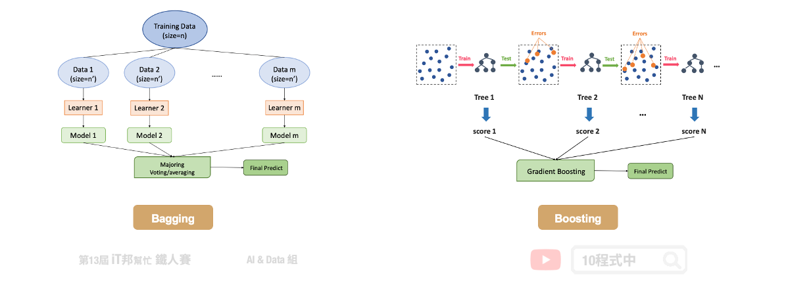
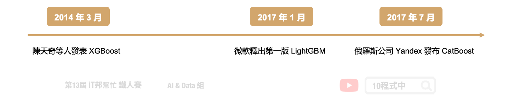
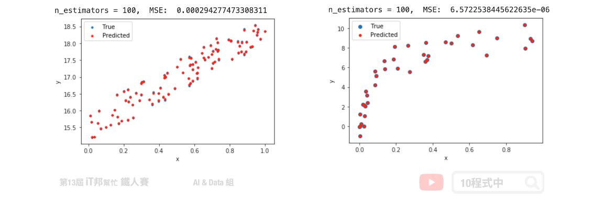

# [Day 15] 機器學習常勝軍 - XGBoost

## 今日學習目標
- XGBoost 介紹
    - XGBoost 是什麼？為什麼它那麼強大？
    - XGBoost 優點
- 比較兩種整體學習架構差異？
    - Bagging vs. Boosting
    - Boosting vs. Decision Tree
- Boosting 方法有哪些
- 實作 XGBoost 分類器與迴歸器
    - 比較 Bagging 與 Boosting 兩者差別

<iframe width="560" height="315" src="https://www.youtube.com/embed/kPvw-b6V-G4" frameborder="0" allow="accelerometer; autoplay; clipboard-write; encrypted-media; gyroscope; picture-in-picture" allowfullscreen></iframe>

<iframe width="560" height="315" src="https://www.youtube.com/embed/xOQNBeB0Eqo" frameborder="0" allow="accelerometer; autoplay; clipboard-write; encrypted-media; gyroscope; picture-in-picture" allowfullscreen></iframe>

範例程式 XGBoost(Classification)：[](https://colab.research.google.com/github/andy6804tw/2021-13th-ironman/blob/main/docs/15.XGBoost/15.1.XGBoost(Classification-iris).ipynb)
範例程式 XGBoost(Regression)：[](https://colab.research.google.com/github/andy6804tw/2021-13th-ironman/blob/main/docs/15.XGBoost/15.2.XGBoost(Regression).ipynb)

## 人人驚奇的 XGBoost
XGboost 全名為 eXtreme Gradient Boosting，是目前 Kaggle 競賽中最常見到的算法，同時也是多數得獎者所使用的模型。此機器學習模型是由華盛頓大學博士生陳天奇所提出來的，它是以 Gradient Boosting 為基礎下去實作，並添加一些新的技巧。它可以說是結合 Bagging 和 Boosting 的優點。XGboost 保有 Gradient Boosting 的做法，每一棵樹是互相關聯的，目標是希望後面生成的樹能夠修正前面一棵樹犯錯的地方。此外 XGboost 是採用特徵隨機採樣的技巧，和隨機森林一樣在生成每一棵樹的時候隨機抽取特徵，因此在每棵樹的生成中並不會每一次都拿全部的特徵參與決策。此外為了讓模型過於複雜，XGboost 在目標函數添加了標準化。因為模型在訓練時為了擬合訓練資料，會產生很多高次項的函數，但反而容易被雜訊干擾導致過度擬合。因此 L1/L2 Regularization 目的是讓損失函數更佳平滑，且抗雜訊干擾能力更大。最後 XGboost 還用到了一階導數和二階導數來生成下一棵樹。其中 Gradient 就是所謂的一階導數，而 Hessian 即為二階導數。 


## XGBoost 優點
XGBoost 除了可以做分類也能進行迴歸連續性數值的預測，而且效果通常都不差。並透過 Boosting 技巧將許多弱決策樹集成在一起形成一個強的預測模型。

- 利用了二階梯度來對節點進行劃分
- 利用局部近似算法對分裂節點進行優化
- 在損失函數中加入了 L1/L2 項，控制模型的複雜度
- 提供 GPU 平行化運算

## Bagging vs. Boosting
在這裡幫大家回顧一下整體學習中的 Bagging 與 Boosting 兩者間的差異。首先 Bagging 透過隨機抽樣的方式生成每一棵樹，最重要的是每棵樹彼此獨立並無關聯。先前所提到的隨機森林就是 Bagging 的實例。另外 Boosting 則是透過序列的方式生成樹，後面所生成的樹會與前一棵樹相關。本章所提及的 XGBoost 就是 Boosting 方法的其中一種實例。正是每棵樹的生成都改善了上一棵樹學習不好的地方，因此 Boosting 的模型通常會比 Bagging 還來的精準。

- Bagging 透過抽樣的方式生成樹，每棵樹彼此獨立
- Boosting 透過序列的方式生成樹，後面生成的樹會與前一棵樹相關



## Boosting vs. Decision Tree
我們再與最一開始所提的決策樹做比較。決策樹通常為一棵複雜的樹，而在 Boosting 是產生非常多棵的樹，但是每一棵的樹都很簡單的決策樹。Boosting 希望新的樹可以針對舊的樹預測不太好的部分做一些補強。最終我們要把所有簡單的樹合再一起才能當最後的預測輸出。

## Boosting 方法有哪些
AdaBoost 是由 Yoav Freund 和 Robert Schapire 於 1995 年提出。所謂的自適應是表示根據弱學習的學習誤差率表現來更新訓練樣本的權重，然後基於調整權重後的訓練集來訓練第二個弱學習器，藉由此方法不斷的迭代下去。

- AdaBoost（Adaptive Boosting)
    - [AdaBoostClassifier](https://scikit-learn.org/stable/modules/generated/sklearn.ensemble.AdaBoostClassifier.html)
    - [AdaBoostRegressor](https://scikit-learn.org/stable/modules/generated/sklearn.ensemble.AdaBoostRegressor.html#sklearn.ensemble.AdaBoostRegressor)

Gradient Boosting 由 Friedman 於 1999 年提出。其中 GBDT (Gradient Boosting Decision Tree) 的弱學習器僅限於只能使用 CART 決策樹模型，並採用加法模型的前向分步算法來解決分類和迴歸問題。

- Gradient Boosting
    - [GradientBoostingClassifier](https://scikit-learn.org/stable/modules/generated/sklearn.ensemble.GradientBoostingClassifier.html)
    - [GradientBoostingRegressor](https://scikit-learn.org/stable/modules/generated/sklearn.ensemble.GradientBoostingRegressor.html#sklearn.ensemble.GradientBoostingRegressor)

接下來介紹三個近年三個強大的開源機器學習專案。首先 [XGBoost](https://xgboost.readthedocs.io/en/latest/) 最初是由陳天奇於 2014 年 3 月發起的一個研究項目，並在短時間內成為競賽中的熱門的模型。接著於 2017 年 1 月微軟發布了第一個穩定的 [LightGBM](https://lightgbm.readthedocs.io/en/latest/) 版本。它是一個基於 Gradient Boosting 的輕量級的演算法，優點在於使用少量資源、更快的訓練效率得到更好的準確度。另外在同年的 4 月，俄羅斯的一家科技公司 Yandex 發布了 [CatBoost](https://catboost.ai/)，其核心依然使用了 Gradient Boosting 技巧，並為類別型的特徵做特別的轉換並產生新的數值型特徵。



未來幾天將會介紹 LightGBM 與 CatBoost 哦！

## [程式實作]
## XGBoost 分類器

Parameters:
- n_estimators: 總共迭代的次數，即決策樹的個數。預設值為100。
- max_depth: 樹的最大深度，默認值為6。
- booster: gbtree 樹模型(預設) / gbliner 線性模型
- learning_rate: 學習速率，預設0.3。
- gamma: 懲罰項係數，指定節點分裂所需的最小損失函數下降值。

Attributes:
- feature_importances_: 查詢模型特徵的重要程度。

Methods:
- fit: 放入X、y進行模型擬合。
- predict: 預測並回傳預測類別。
- score: 預測成功的比例。
- predict_proba: 預測每個類別的機率值。

```py
from xgboost import XGBClassifier

# 建立 XGBClassifier 模型
xgboostModel = XGBClassifier(n_estimators=100, learning_rate= 0.3)
# 使用訓練資料訓練模型
xgboostModel.fit(X_train, y_train)
# 使用訓練資料預測分類
predicted = xgboostModel.predict(X_train)
```

### 使用Score評估模型
我們可以直接呼叫 `score()` 直接計算模型預測的準確率。

```py
# 預測成功的比例
print('訓練集: ',xgboostModel.score(X_train,y_train))
print('測試集: ',xgboostModel.score(X_test,y_test))
```

輸出結果：
```
訓練集:  1.0
測試集:  0.9333333333333333
```

大家可以試著與前幾天的決策樹和隨機森林兩個模型相比較。是不是 XGBoost 有著更好的預測結果呢？因為有了 Gradient Boosting 學習機制，大幅提升了預測能力。在學習過程中將預測不好的地方，尤其是橘色 (Versicolour) 與綠色 (Virginica) 交界處有更好的評估能力。


## XGBoost (迴歸器)

Parameters:
- n_estimators: 總共迭代的次數，即決策樹的個數。預設值為100。
- max_depth: 樹的最大深度，默認值為6。
- booster: gbtree 樹模型(預設) / gbliner 線性模型
- learning_rate: 學習速率，預設0.3。
- gamma: 懲罰項係數，指定節點分裂所需的最小損失函數下降值。

Attributes:
- feature_importances_: 查詢模型特徵的重要程度。

Methods:
- fit: 放入X、y進行模型擬合。
- predict: 預測並回傳預測類別。
- score: 預測成功的比例。
- predict_proba: 預測每個類別的機率值。

```py
import xgboost as xgb

# 建立 XGBRegressor 模型
xgbrModel=xgb.XGBRegressor()
# 使用訓練資料訓練模型
xgbrModel.fit(x,y)
# 使用訓練資料預測
predicted=xgbrModel.predict(x)
```



## Reference
- [XGboost入門經驗分享-超參數解析](https://medium.com/@pahome.chen/xgboost%E5%85%A5%E9%96%80%E7%B6%93%E9%A9%97%E5%88%86%E4%BA%AB-e06931b835f5)
- [關於 XGBoost 20 個 FAQ](https://towardsdatascience.com/20-burning-xgboost-faqs-answered-to-use-the-library-like-a-pro-f8013b8df3e4)

> 本系列教學內容及範例程式都可以從我的 [GitHub](https://github.com/andy6804tw/2021-13th-ironman) 取得！