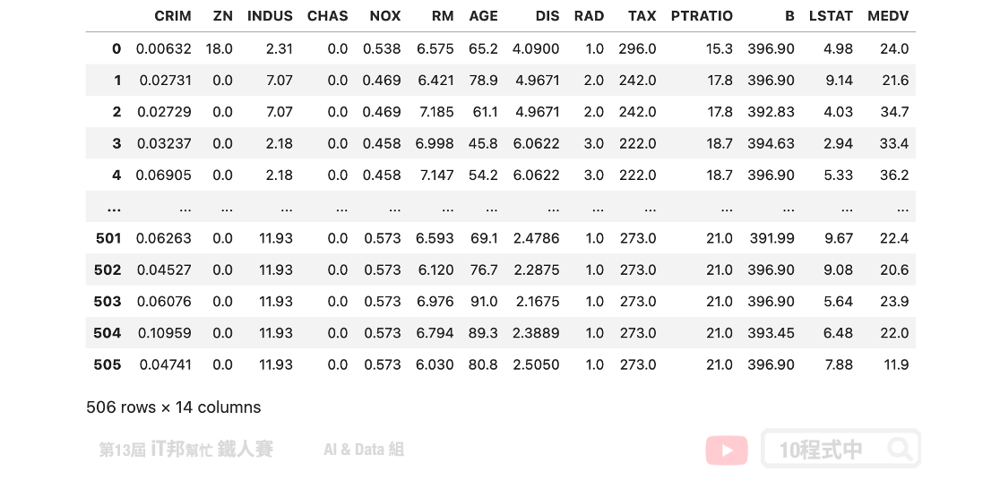

# 堆疊法 (Stacking)
## 今日學習目標
- 了解 Stacking 方法
    - 堆疊法的學習機制為何？
- 利用 Stacking 實作迴歸器
    - 透過 Stacking Regressor 建立房價預測模型


範例程式：[]()

## 前言
堆疊法 (Stacking) 是整體學習中其中一種實例。它是結合許多獨立的模型所預測出來的結果，並將每個獨立模型的輸出視為最終模型預測的輸入特徵，最後再訓練一個最終模型。以下圖為例，假設我們事先訓練三個基底的模型 (base learner)，這三個模型彼此互相無關連。由於每一個模型所訓練出來的預測能力都不同，也許模型一在某個區段的資料有不太好的預測能力，而模型二能補足模型一預測不好的地方。藉由上述這個觀點我們將三個訓練好的模型輸出集合起來(P1、P2、P3)，如果是分類問題可以透過投票方式，而迴歸問題可以採用平均法或是加權平均法將所有的預測做最後評估。又或者是可以將這三個輸出值當作是新模型的特徵再丟入一個機器學型模型做最後的預測得到最終輸出。


## [程式實作]
在此範例中我們透過 Sklearn 所提供的波士頓房價預測資料集進行 Stacking 方法建模。並觀察同一組資料在單一模型下預測，與加入 Stacking 機制後的結果有無改善。

## 1) 載入資料集
首先我們夠過 Sklearn 套件讀入波士頓房價資料集，並將輸入特徵與房價合併成一個 DataFrame。在此資料集中總共有 13 個輸入特徵，以及一個輸出 `MEDV` 即為房價。

```py
# load boston_dataset
boston_dataset = load_boston()
boston = pd.DataFrame(boston_dataset.data, columns=boston_dataset.feature_names)
boston['MEDV'] = boston_dataset.target
boston
```



## 2) 切割訓練集與測試集
在此範例中我們著重於比較模型的差異，因此沒有按照正常的機器學習流程走。資料視覺化以及前處理...等是非常重要的哦！在此步驟我們快速物的將乾淨的資料切出訓練集與測試集，其中訓練集 `X_train` 與 `y_train` 是實際參與行訓練的資料。而 `X_test` 與 `y_test` 是未參與訓練的資料，它是被拿來測試評估最終訓練好的模型。

```py
from sklearn.model_selection import train_test_split
X  = boston.drop(['MEDV'],axis=1).values
y = boston[['MEDV']].values
X_train, X_test, y_train, y_test = train_test_split(X, y, test_size=0.1, random_state=42)
print('Training data shape:', X_train.shape)
print('Testing data shape:', X_test.shape)
```

由於 Sklearn 資料集提供的資料樣本數比較少，因此測試集僅切出 0.1 的資料。

執行結果：
```
Training data shape: (455, 13)
Testing data shape: (51, 13)
```

## XGBoost 模型
因為要與 Stacking 做一個比較。因此這裡使用 XGBoost 先訓練一個模型，並將結果與 Stacking 做比較。

```py
from xgboost import XGBRegressor

# 建立 XGBRegressor 模型
xgboostModel = XGBRegressor()
# 使用訓練資料訓練模型
xgboostModel.fit(X_train, y_train)
# 使用訓練資料預測
predicted = xgboostModel.predict(X_train)

print("訓練集 Score: ", xgboostModel.score(X_train,y_train))
print("測試集 Score: ", xgboostModel.score(X_test,y_test))
```

從預測結果我們先來查看 R2 score，一切看似還 ok。不過這裡要呼籲各位讀者絕不要看 R2 分數高就高興得太早！

執行結果：
```
訓練集 Score:  0.9999920949016282
測試集 Score:  0.9292786904177338
```

我們來看一下 MSE 實際算一下訓練集與測試集的誤差。可以發現很明顯的過度擬合了，簡單來說在訓練集的資料算出來的 MSE 很小，但是在測試集中 MSE 預測能力不足造成誤差變大。

```py
from sklearn import metrics

# 訓練集 MSE
train_pred = xgboostModel.predict(X_train)
mse = metrics.mean_squared_error(y_train, train_pred)
print('訓練集 MSE: ', mse)
# 測試集 MSE
test_pred = xgboostModel.predict(X_test)
mse = metrics.mean_squared_error(y_test, test_pred)
print('測試集 MSE: ', mse)
```

執行結果：
```
訓練集 MSE:  0.0006847746512112584
測試集 MSE:  4.415429632025227
```

## Stacking 模型
Stacking 結合許多弱學習器，將所有的弱學習器的輸出當作新的模型的輸入接著預測最終結果。在此範例中我們建立了四種迴歸器，分別有隨機森林、支持向量機、KNN 與決策樹。最終的模型我們採用兩層隱藏層的神經網路作為最後的房價預測評估模型。

Parameters:
- estimators: m 個弱學習器。
- final_estimator: 集合所有弱學習器的輸出，訓練一個最終預測模型。預設為LogisticRegression。

Attributes:
- estimators_: 查看弱學習器組合。
- final_estimator: 查看最終整合訓練模型。

Methods:
- fit: 放入X、y進行模型擬合。
- predict: 預測並回傳預測類別。
- score: 預測成功的比例。
- predict_proba: 預測每個類別的機率值。

```py
from sklearn.ensemble import RandomForestRegressor
from sklearn.linear_model import LinearRegression
from sklearn import svm
from sklearn.neighbors import KNeighborsRegressor
from sklearn.tree import DecisionTreeRegressor
from sklearn.ensemble import StackingRegressor
from sklearn.neural_network import MLPRegressor


estimators = [
    ('rf', RandomForestRegressor(random_state = 42)),
    ('svr', svm.SVR()),
    ('knn', KNeighborsRegressor()),
    ('dt', DecisionTreeRegressor(random_state = 42))
]
clf = StackingRegressor(
    estimators=estimators, final_estimator= MLPRegressor(activation = "relu", alpha = 0.1, hidden_layer_sizes = (8,8),
                            learning_rate = "constant", max_iter = 2000, random_state = 1000)
)

clf.fit(X_train, y_train)

print("訓練集 Score: ", clf.score(X_train,y_train))
print("測試集 Score: ", clf.score(X_test,y_test))
```

我們先觀察訓練後的 R2 score 在訓練集與測試集上的分數。從數值看觀察可以發現透過堆疊法兩者間的分數差距變小了。

輸出結果：
```
訓練集 Score:  0.9608703782891547
測試集 Score:  0.9371735287625855
```


```py
from sklearn import metrics

# 訓練集 MSE
train_pred = clf.predict(X_train)
mse = metrics.mean_squared_error(y_train, train_pred)
print('訓練集 MSE: ', mse)
# 測試集 MSE
test_pred = clf.predict(X_test)
mse = metrics.mean_squared_error(y_test, test_pred)
print('測試集 MSE: ', mse)
```

接著我們一樣計算 MSE 實際觀察模型在訓練集與測試集上的誤差。從計算解果可以看到兩者的誤差都是差不多的。從這裡我們就可以很清楚的知道透過 Stacking 可以避免模型過擬合，並且透過多個基底的模型讓最終預測結果有比較平滑的輸出。

輸出結果：
```
訓練集 MSE:  3.389581229598408
測試集 MSE:  3.9225215768179433
```

> 本系列教學內容及範例程式都可以從我的 [GitHub](https://github.com/andy6804tw/2021-13th-ironman) 取得！