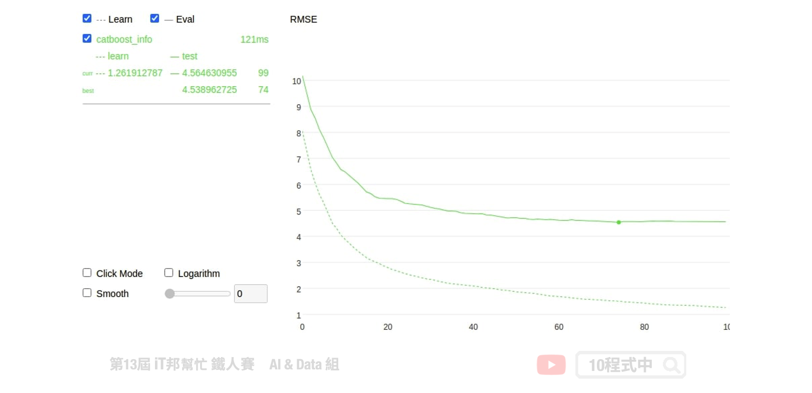

# CatBoost

## 今日學習目標
- 了解 CatBoost 模型
- 實作 CatBoost 迴歸模型-房價預測
    - 模型訓練、特徵篩選
    - 超參數搜索
    - 自動處理類別型的特徵
    - 可解釋化模型

<iframe width="560" height="315" src="https://www.youtube.com/embed/" frameborder="0" allow="accelerometer; autoplay; clipboard-write; encrypted-media; gyroscope; picture-in-picture" allowfullscreen></iframe>

範例程式：[]()

## 前言
CatBoost 同樣是基於 Gradient Boosting Tree 的梯度提升樹模型框架，最大的特點對類別特徵的直接支援，甚至允許字串類型的特徵進行模型訓練。近年來在 Kaggle 上的比賽陸續有人使用 CatBoost 方法並取得不錯的成績，於是就來撰寫文章順便來瞧瞧它與其他 Boosting 演算法不同之處。其中最特別的地方是 CatBoost 能夠處理非數值型態的資料，也就是説無需對數據特徵進行任何的預處理就可以將類別轉換爲數字。CatBoost 採用決策樹梯度提升方法並宣稱在效能上比 XGBoost 和 LightGBM 更加優化，同時支援 CPU 和 GPU 運算。與其他 Boosting 方法相比 CatBoost 是一種相對較新的開源機器學習算法。該演算法是由一間俄羅斯的公司 Yandex 於 2017 年所提出，同時在 arxiv 有一篇 [CatBoost: unbiased boosting with categorical features](https://arxiv.org/pdf/1706.09516.pdf) 的論文，文中作者詳細說明了 CatBoost 的方法與優點。


## CatBoost 優點
CatBoost 名稱源於 Category 和 Boost 兩個單詞，承襲 Boosting 的優點之外該演算法在類別型的特徵上做了一些更公平的特徵工程。訓練過程中允許沒有編碼的類別特徵，透過分類和數字特徵組合的各種統計量為類別型的特徵做編碼。不過在訓練前必須確保該特徵中無缺失值。其訓練資料若有缺失值 CatBoost 預設會將數值型的資料補上最小值，詳細內容可以[參考](https://catboost.ai/docs/concepts/algorithm-missing-values-processing.html#numerical-features)。另外對於 GPU 的使用者，它也能處理字串(類別)型態的特徵。

- 自動處理類別型的特徵
- 自動處理缺失值
- 可以處理各種數據類型，如音頻、文字、圖像
- 減少人工調參的需要，並降低了過擬合的機會


## CatBoost 安裝
CatBoost 演算法可以解決分類 (CatBoostClassifier) 和迴歸 (CatBoostRegressor) 的問題。安裝的方式也非常簡單，使用 `pip` 就能輕鬆安裝。

```bash
pip install catboost
```

## CatBoost Parameters
CatBoost 基本上可以自由的讓演算法去選擇最佳的模型，不過 API 還是提供一些基本的超參數讓使用者手動調整。

Parameters:
- iterations: 總共迭代的次數，即決策樹的個數。預設值為 1000。
- use_best_model: 設定 True 時必須給定驗證集，將會留下驗證集分中數最高的模型。
- early_stopping_rounds: 連續訓練N代，若結果未改善則提早停止訓練。
- od_type: IncToDec/Iter，預設 Iter 防止 Overfitting 評估方式，若設定前者需要設定閥值。
- eval_metric: 模型評估方式。
- loss_function: 計算loss方法。
- verbose: True(1)/Flase(0)，預設1顯示訓練過程。
- random_state: 亂數種子，確保每次訓練結果都一樣。
- learning_rate: 預設 automatically。
- depth: 樹的深度，預設 6。
- cat_features: 輸入類別特徵的索引，它會自動幫你處理。

[參考](https://catboost.ai/docs/concepts/python-reference_parameters-list.html)

Attributes:
- feature_importances_: 查詢模型特徵的重要程度。

Methods:
- fit: 放入X、y進行模型擬合。
- predict: 預測並回傳預測類別。
- score: 預測成功的比例。

如果需要手動處理 Overfitting 問題可以參考這份官方[文件](https://catboost.ai/docs/features/overfitting-detector-desc.html) 

## 模型訓練
模型訓練方式基本上與 XGBoost 一樣，如果你熟悉 sklearn 的話 CatBoost 的使用方式基本上大同小異。只不過在 CatBoost 中多了一些方便的方法和參數可以使用。像是在訓練過程中可以加上 `plot=True`，並在 eval_set 參數中插入測試集可以即時看到訓練過程的視覺化分析。甚至可以使用交叉驗證，在不同的分割上觀察模型準確度的平均和標準偏差。

```py
from catboost import CatBoostRegressor

# 建立模型
model = CatBoostRegressor(random_state=42,
                         loss_function='RMSE',
                         eval_metric='RMSE',
                         use_best_model=True)
# 使用訓練資料訓練模型
model.fit(X_train,y_train, eval_set=(X_test, y_test), verbose=0, plot=True)
```



## 特徵篩選
訓練過程中會自動從資料中篩選對模型預測有用的特徵，並移除無幫助預測的特徵。

- [參考](https://catboost.ai/docs/concepts/python-reference_catboost_select_features.html)


```py
from catboost import CatBoostRegressor, Pool, EShapCalcType, EFeaturesSelectionAlgorithm

# feature_names = ['F{}'.format(i) for i in range(X_train.shape[1])]
train_pool = Pool(X_train, y_train, feature_names=boston_dataset.feature_names.tolist())
test_pool = Pool(X_test, y_test, feature_names=boston_dataset.feature_names.tolist())

model = CatBoostRegressor(random_state=42,
                         loss_function='RMSE',
                         eval_metric='RMSE',
                         use_best_model=True)
summary = model.select_features(
    train_pool,
    eval_set=test_pool,
    features_for_select='0-12',
    num_features_to_select=3,
    steps=2,
    algorithm=EFeaturesSelectionAlgorithm.RecursiveByShapValues,
    shap_calc_type=EShapCalcType.Regular,
    train_final_model=True,
    logging_level='Silent',
    plot=False
)
summary
```

由於在訓練將 `num_features_to_select` 設為三，即表示模型訓練時會拿取三個最重要特徵當作做中模型預測方式。我們採用 sklearn 的房價預測資料集，結果可以發現三個最重要特徵為 ['RM', 'PTRATIO', 'LSTAT']。如果你有做 EDA 可以發現這三個特徵與房價的關聯性都很高。

```
{'selected_features': [5, 10, 12],
 'eliminated_features_names': ['DIS',
  'B',
  'ZN',
  'CHAS',
  'RAD',
  'INDUS',
  'CRIM',
  'AGE',
  'TAX',
  'NOX'],
 'eliminated_features': [7, 11, 1, 3, 8, 2, 0, 6, 9, 4],
 'selected_features_names': ['RM', 'PTRATIO', 'LSTAT']}
```

## Grid search
除此之外 CatBoost 提供對模型的指定參數值進行簡單的網格搜索，如果有使用過 sklearn 的 Grid Search 其實他就是一樣的使用方式。

- [參考](https://catboost.ai/docs/concepts/python-reference_catboostregressor_grid_search.html)

```py
from catboost import CatBoostRegressor
grid = {'iterations': [100, 150, 200],
        'learning_rate': [0.03, 0.1],
        'depth': [2, 4, 6, 8],
        'l2_leaf_reg': [0.2, 0.5, 1, 3]}

model = CatBoostRegressor(random_state=42,
                         loss_function='RMSE',
                         eval_metric='RMSE')
model.grid_search(grid, X_train,y_train)
```

## 自動處理類別型的特徵
CatBoost 無需對數據特徵進行任何的預處理就可以將類別轉換爲數字。下面程式為一個分類問題的範例，其中輸入特徵的第一個為季節。在機器學習上的認知我們必須將所以字串型資料必須透過標籤編碼方式轉換成數值，然而在 CatBoost 完全不需要。僅需在訓練模型時給予參數 `cat_features = [0]` 即代表資料的第一個特徵需要進行類別轉換。另外輸出葉不一定要編碼後的結果，你也可以丟入文字進行訓練只要加上 `loss_function='MultiClass'` 即可。

```py
from catboost import Pool, CatBoostClassifier

train_data = [["summer", 1924, 44],
              ["summer", 1932, 37],
              ["winter", 1980, 37],
              ["summer", 2012, 204]]

eval_data = [["winter", 1996, 197],
             ["winter", 1968, 37],
             ["summer", 2002, 77],
             ["summer", 1948, 59]]

train_label = ["France", "USA", "USA", "UK"]
eval_label = ["USA", "France", "USA", "UK"]


# Initialize CatBoostClassifier
model = CatBoostClassifier(iterations=10,
                           learning_rate=1,
                           depth=2,
                           cat_features = [0],
                           loss_function='MultiClass')
# Fit model
model.fit(train_data, train_label)
# Get predicted classes
preds_class = model.predict(eval_data)
# Get predicted probabilities for each class
preds_proba = model.predict_proba(eval_data)
# Get predicted RawFormulaVal
preds_raw = model.predict(eval_data, 
                          prediction_type='RawFormulaVal')
```

[參考](https://catboost.ai/docs/concepts/python-usages-examples.html)


## 善用 Verbose
訓練過程中可以隨時觀察訓練集與測試集的loss，使用verbose=10即代表每10次迭代會顯示一次資訊，這種方式也解決每次疊代顯示一次的困擾。訓練過程中剩餘時間也會顯示出來。


## 模型的解釋
CatBoost 提供了 `plot` 可以方便在訓練時查看並作即時分析訓練趨勢。除此之外 CatBoost 也支援 SHAP 增加了模型可解釋。詳細的使用方式可以參考官方[教學](https://shap.readthedocs.io/en/latest/example_notebooks/tabular_examples/tree_based_models/Catboost%20tutorial.html)。


## 小結
CatBoost 的優點和使用方法都介紹完了，是不是覺得十分簡單易用且功能強大。尤其是遇到資料需要大量處理和特徵數值化的任務時最適合使用 CatBoost 了。真的是所謂的懶人套件，名符其實的 Ying Train Yi Fa(硬Train一發)!


## Reference
- [Tutorial: CatBoost Overview](https://www.kaggle.com/mitribunskiy/tutorial-catboost-overview)
- [SHAP Catboost tutorial](https://shap.readthedocs.io/en/latest/example_notebooks/tabular_examples/tree_based_models/Catboost%20tutorial.html)
- [CatBoost regression in 6 minutes](https://towardsdatascience.com/catboost-regression-in-6-minutes-3487f3e5b329)
- [Catboost：超越Lightgbm和XGBoost的又一個boost算法神器](https://www.xuehua.us/a/5ebf84b0fdbefd9ba19e8d2f?lang=zh-tw)
- [CatBoost、LightGBM、XGBoost，這些算法你都瞭解嗎？](https://www.xuehua.us/a/5eb594cf86ec4d63e698d3e7?lang=zh-tw)

> 本系列教學內容及範例程式都可以從我的 [GitHub](https://github.com/andy6804tw/2021-13th-ironman) 取得！