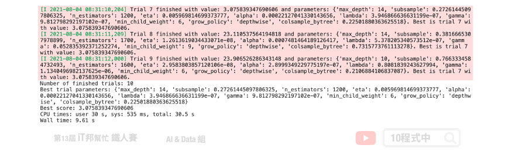

# Optuna
## 今日學習目標
- Optuna 如何採樣參數？
- 實作 Optuna 搜尋最佳超參數
    - 以 XGBoost 迴歸模型於房價預測為例
    - Optuna 視覺化分析搜尋結果

<iframe width="560" height="315" src="https://www.youtube.com/embed/" frameborder="0" allow="accelerometer; autoplay; clipboard-write; encrypted-media; gyroscope; picture-in-picture" allowfullscreen></iframe>

## 前言
你是否曾經覺得模型有太多的超參數而感到厭煩嗎？要從某一個演算法得到好的解必須要調整超參數，所謂的超參數就是控制訓練模型的一組神秘數字，例如學習速率就是一種超參數。你永遠都不知道 0~1 之間哪一個數字是最適合的，唯一的方法就是試錯 (trial and error)。那萬一模型有多個超參數可以控制，豈不是就有成千上萬種組合要慢慢嘗試嗎？如果你有也這個問題，看這篇就對了！雖然你可能聽過 Sklearn 的 GridSearchCV 同樣也是暴力的找出最佳參數，或是使用 RandomizedSearchCV 指定超參數的範圍並隨機的抽取參數進⾏訓練，其它們的共同缺點是非常耗時與佔用機器資源。這裡我們要來介紹 Optuna 這個自動找超參數的方便工具，並且可以和多個常用的機器學習演算法整合。Optuna 透過調整適當的超參數來提高模型預測能力，此專案最初於 2019 發表於 arxiv 的一篇論文 [Optuna: A Next-generation Hyperparameter Optimization Framework](https://arxiv.org/abs/1907.10902) 同時開源在 [GitHub](https://github.com/optuna/optuna) 上免費提供大家使用。同時 Optuna 也是 2021 年 Kaggle 資料科學競賽中最常見的模型調參工具。那是什麼原因讓 Optuna 受到廣大的機器學習社群如此的歡迎呢？就讓我們來看看他是如此地強大吧！


## 關於 Optuna
Optuna 是一個專為機器學習設計的自動超參數優化的框架。其最突出的特點是：

- 人性化的定義搜索空間。
- 支援大多數 ML 與 DL 的學習套件。例如: Sklearn、PyTorch、TensorFlow, XGBoost、LightGBM、 CatBoost...等。
- 對對搜索結果提供可解釋性(XAI)。
- 儲存歷史最佳的參數實現平行優化工作。
- 決定並終止不滿足預定義條件的試驗。

## Optuna 簡單範例
這裡我們設定一個簡單的目標函式 $(x1+2)^2 + (x2-4)^2$。我們都知道當這個式子 x1=-2, x2=4 時將會有極小值 0。因此我們就用這個簡單的例子透過 Optuna 找出這個函式中極小值所對應的 x1 與 x2 吧。

```py
import optuna

def objective(trial):
    x1 = trial.suggest_float("x1", -5, 5)
    x2 = trial.suggest_float("x2", -5, 5)
    return (x1 + 2) ** 2 + (x2 - 4) ** 2
```

首先載入 `optuna` 套件，如果尚未安裝此套件的的讀者可以參考以下指令進行安裝：

```sh
pip install optuna
```

接著我們來定義一個找出極小值的目標函式 `objective()`。在這個函式中我們將要設定 optuna 可以去尋找的一參數，也就是 x1 與 x2。我們可以透過 optuna 所提供的 `trial` 物件來為我們的超參數設定一組範圍。其中它有一個 `suggest_float` 方法，該方法採用超參數的名稱和範圍來尋找其最佳值。我們以 x1 來舉例：

```
x1 = trial.suggest_float("x1", -5, 5)
```

上面這一段程式在 GridSearch 中可以表示成 `{"x1": np.arange(-5, 5, .1)}`。即表示搜尋過程中我們會從 x1 隨機設定 -5~5 之間的任一浮點數。設定完函式後就可以開始優化了，我們從 optuna 建立一個 `study` 物件，並將 `objective` 函數傳遞給 `study` 的 `optimize` 方法。由於我們的目標是要找出函式中的極小值，因此 `direction` 設為 `minimize`。另外在 `optimize` 方法中我們也可以設定試驗的次數(n_trials)或時間(timeout)。一切就緒後即可開始執行！以下範例是迭代50次並從中找到一組最佳的 x1 與 x2 使其目標函式可以最小化。跑完 50 次後我們可以經由 `study` 變數中得到一組最佳的解。試驗結束後我們可以發現 x1 趨近於 -2 和 x2 趨近於 4。

```py
%%time
# Creating Optuna object and defining its parameters
study = optuna.create_study(direction='minimize')
study.optimize(objective, n_trials = 50)

# Showing optimization results
print('Number of finished trials:', len(study.trials))
print('Best trial parameters:', study.best_trial.params)
print('Best score:', study.best_value)
```

輸出結果：
```
Number of finished trials: 50
Best trial parameters: {'x1': -1.8154924755761588, 'x2': 3.9141985823539844}
Best score: 0.04140490983908035
CPU times: user 432 ms, sys: 46.3 ms, total: 478 ms
Wall time: 431 ms
```

由上述的簡單例子我們可以知道建立一個 optuna 最佳化流程僅需要三步驟：
1. 建立 objective 函式與設定 trial，並回傳 loss。
2. 建立 `create_study()` 物件。
3. 使用 `optimize()` 執行搜尋。

## End-to-end example with XGBoost
我們以 Sklearn 所提供的房價預測資料夾來做範例。此資料集共有 506 筆資料，其中輸入特徵有 13 個其輸出為預測該筆資料的房價。由於想要快速示範如何使用 optuna，因此這裡就不做任何資料 EDA 與前處理。

```py
from sklearn.datasets import load_boston
X, y = load_boston(return_X_y=True)
print('X:',X.shape)
print('y:',y.shape)
```

輸出結果：
```
X: (506, 13)
y: (506,)
```

資料集成功被載入後我們就可以建立一個 objective 函式。在這個目標函式中，我們建立了一個小範圍的的 XGBoost 超參數搜索空間。其每一個超參數都會有一個搜索的範圍，可以使用 `suggest_*` 方法設定區間。此方法必須輸入超參數的名稱，以及給予該參數的一組隨機範圍其型態有很多例如：`suggest_int`、`suggest_discrete_uniform`、`suggest_float`...等。更多詳細的內容可以從[官方文件](https://optuna.readthedocs.io/en/stable/reference/generated/optuna.trial.Trial.html)取得。或是也可以參考官方在 [GitHub](https://github.com/optuna/optuna-examples/tree/main/xgboost) 上對於 XGBoost 的使用範例。

```py
import optuna
import xgboost as xgb
from sklearn.metrics import mean_squared_error
from sklearn.model_selection import train_test_split

def objective(trial, X=X, y=y):
    """
    A function to train a model using different hyperparamerters combinations provided by Optuna.
    """
    X_train, X_valid, y_train, y_valid = train_test_split(X, y, test_size=0.4)

    params = {
        'max_depth': trial.suggest_int('max_depth', 6, 15),
        "subsample": trial.suggest_float("subsample", 0.2, 1.0),
        'n_estimators': trial.suggest_int('n_estimators', 500, 2000, 100),
        'eta': trial.suggest_float("eta", 1e-8, 1.0, log=True),
        'alpha': trial.suggest_float('alpha', 1e-8, 1.0, log=True),
        'lambda': trial.suggest_float('lambda', 1e-8, 1.0, log=True),
        'gamma': trial.suggest_float("gamma", 1e-8, 1.0, log=True),
        'min_child_weight': trial.suggest_int('min_child_weight', 2, 10),
        'grow_policy': trial.suggest_categorical("grow_policy", ["depthwise", "lossguide"]),
        "colsample_bytree": trial.suggest_float("colsample_bytree", 0.2, 1.0)
    }

    reg = xgb.XGBRegressor(**params)
    reg.fit(X_train, y_train,
            eval_set=[(X_valid, y_valid)], eval_metric='rmse',
            verbose=False)
    return mean_squared_error(y_valid, reg.predict(X_valid), squared=False)
```

設定好調參的區間後，即可開始囉。

```py
%%time
# Creating Optuna object and defining its parameters
study = optuna.create_study(direction='minimize')
study.optimize(objective, n_trials = 10)

# Showing optimization results
print('Number of finished trials:', len(study.trials))
print('Best trial parameters:', study.best_trial.params)
print('Best score:', study.best_value)
```



Optuna 預設的超參數搜尋方法能有效地在短時間內往最佳的方向去尋找一組適合的參數。與 GridSearch 相比原本可能需要數小時的搜索空間在短短的幾分鐘內就可以獲得不錯的經果。並且有效的降低 loss。除了迴歸問題 Optuna 也能對分類問題進行超參數搜尋，官方的 [GitHub](https://github.com/optuna/optuna-examples) 也有提供各種不同機器學習框架的寫法。

##  Optuna 如何採樣參數？
TPESampler 為預設的超參數採樣器。它試圖透過提高最後一次試驗的分數來對超參數候選者進行採樣。除此之外 Optuna 提供了以下這幾個參數採樣的方式:
- `GridSampler`: 與 Sklearn 的 `GridSearch` 採樣方式相同。使用此方法時建議不要設定太大的範圍。
- `RandomSampler`: 與 Sklearn 的 `RandomizedGridSearch` 採樣方式相同。
- `TPESampler`: 全名 Tree-structured Parzen Estimator sampler。預設採樣方式。
- `CmaEsSampler`: 基於 CMA ES 演算算法的採樣器 (不支援類別型的超參數).

如果需要替換採樣參數的方式可以參考以下程式。

```py
from optuna.samplers import CmaEsSampler, RandomSampler

# Study with a random sampler
study_1 = optuna.create_study(sampler=RandomSampler(seed=42))

# Study with a CMA ES sampler
study_2 = optuna.create_study(sampler=CmaEsSampler(seed=42))
```

## Optuna 視覺化分析
Optuna 在同時也提供了視覺化的套件:
- plot_optimization_history (視覺化優化的過程)
- plot_intermediate_values (視覺化學習的曲線)
- plot_parallel_coordinate (視覺化高維度中參數間的彼此關係)
- plot_contour (視覺化參數間的彼此關係)
- plot_slice (視覺化個別參數)
- plot_param_importances (參數對模型的重要程度)
- plot_edf (視覺化驗分佈函數)


延續上面的範例我們來視覺化展示 Optuna 搜尋的過程與結果。首先我們來繪製 `study` 的優化歷史過程。這張圖告訴我們，Optuna 只經過幾次試驗就使分數收斂到最小值。

```py
from optuna.visualization import plot_optimization_history

plotly_config = {"staticPlot": True}

fig = plot_optimization_history(study)
fig.show(config=plotly_config)
```


接下來，讓我們繪製超參數重要性。從這張圖我們可以發現 eta(learning_rate) 學習速率是最為重要的。此外 grow_policy 與 lambda 對減少 loss 上無太大幫助。因此在下一次執行試驗的時候可以考慮將無用的參數移除，並將重要的超參數範圍加大取得更好的搜索結果。其他的使用方法可以 [參考](https://optuna.readthedocs.io/en/stable/reference/visualization/index.html) 官方的說明文件。

```py
from optuna.visualization import plot_param_importances

fig = plot_param_importances(study)
fig.show(config=plotly_config)
```


## 小結
今天我們介紹了這一個超參數最佳化的工具，裡面有太多功能尚未提到。例如：試驗的剪枝，簡單來說就是設定試驗的例外條件當不滿足預定條件即不執行此次試驗。或是儲存歷史最佳的參數實現平行優化工作。除此之外此套件還支援像是 SQLite 等資料庫可以儲存歷史搜尋結果快速的達到最佳搜尋能力。重點此套件還支援神經網路的參數搜尋以及網路的寬度深度選擇。常見的深度學習框架都能支援例如 TensorFlow、PyTorch，MXNet...等。

## Reference
- [OPTUNA: A Flexible, Efficient and Scalable Hyperparameter Optimization Framework](https://towardsdatascience.com/optuna-a-flexible-efficient-and-scalable-hyperparameter-optimization-framework-d26bc7a23fff)
- [optuna.org](https://optuna.org/)

> 本系列教學內容及範例程式都可以從我的 [GitHub](https://github.com/andy6804tw/2021-13th-ironman) 取得！