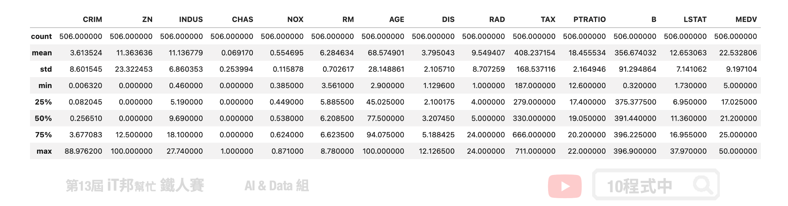
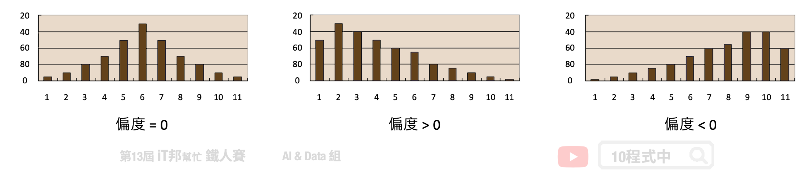
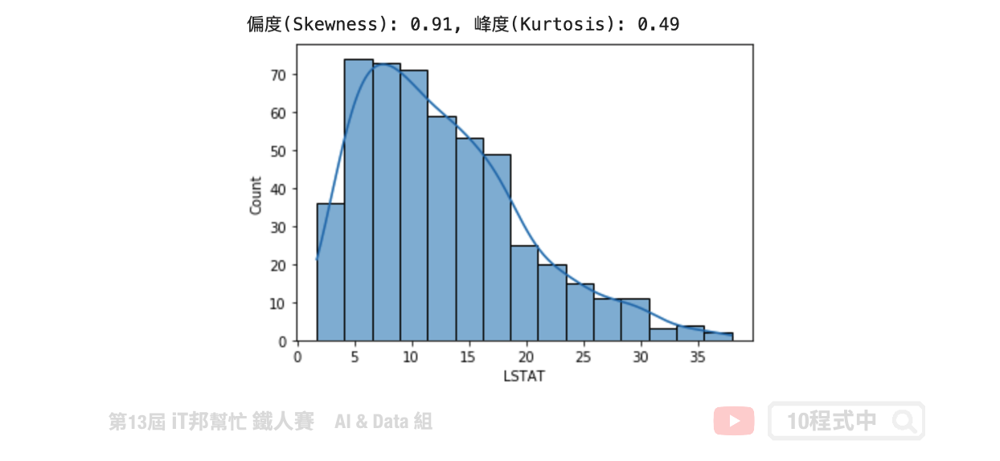
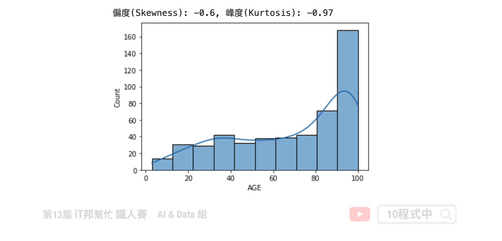
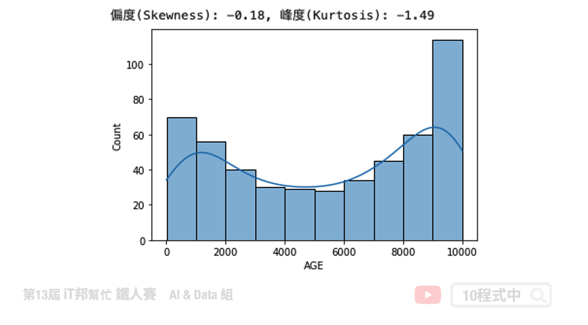
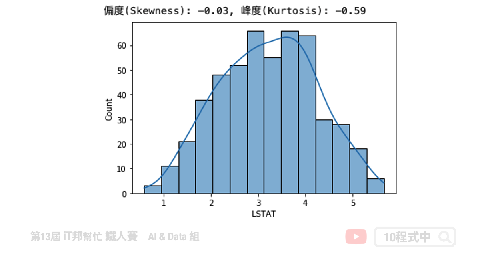

# [Day 23] 資料分布與離群值處理
## 今日學習目標
- 資料特徵觀察與離群值分析
- 檢視資料的分布狀態
    - 偏度 (Skewness)
    - 峰度 (Kurtosis)
- 修正特徵偏度的方法


範例程式：[](https://colab.research.google.com/github/andy6804tw/2021-13th-ironman/blob/main/docs/23.資料分布與離群值處理/23.資料分布與離群值處理.ipynb)

## 前言
資料前處理 (Data Preprocessing)，是機器學習中最重要的一部分。今日的內容可分為兩部份，前半部份算是一些對資料的觀察與分析，後半部主要是針對特徵 x 進行統計方法的資料分布觀察以及如何修正資料單峰偏左和偏右的常見方法。

## 載入資料
在今日的範例中我們採用波士頓房價預測的資料集。此資料集共有 506 筆資料。其中我們挑選兩個特徵來進行示範，分別有 LSTAT: 區域中被認為是低收入階層的比例、AGE: 1940年之前建成的自用房屋比例。

```py
import numpy as np
import pandas as pd  
import matplotlib.pyplot as plt 
import seaborn as sns 
from sklearn.datasets import load_boston

# 載入資料集
boston_dataset = load_boston()
# 將資料轉換成pd.DataFrame格式。目標輸出是MEDIV，剩下的就是特徵即為輸入特徵。
boston = pd.DataFrame(boston_dataset.data, columns=boston_dataset.feature_names)
boston['MEDV'] = boston_dataset.target
boston
```


我們可以透過 Pandas 的 `describe()` 方法先來查看每個特徵的平均數、標準差、四分位數以及最大值與最小值。

```py
# 查看資料分布狀況
boston.describe()
```



## 離群值分析
以 `LSTAT` 特徵舉例。我們可以透過 boxplot 來查看該特徵在 506 筆資料中的分布狀況，我們可以看出平均值約 12，最大值接近 38，最小值接近 2。我們可以發現大於 32 以外有多個零散的數據點，這些資料我們可以來分析是否為異常點。因為這些異常點所造成的離群值可能會造成特徵的分布狀況嚴重的偏移。

```python
plt.figure(figsize=(2,5))
plt.boxplot(boston['LSTAT'],showmeans=True)
plt.title('LSTAT')
plt.show()
```


## 偏度 & 峰度
### 偏度 (Skewness)
偏度 (Skewness) 是用來衡量資料分布的型態，同時也說明資料分配不對稱的程度。其判別方式如下：



- 右偏(正偏)，表示有少數幾筆資料很大，故平均數>中位數，所以偏度>0。
- 偏度=0 表示資料分布對稱，呈鐘形常態分布。
- 左偏(負偏)，表示有少數幾筆資料很小，故平均數<中位數，所以偏度<0。

### 峰度 (Kurtosis)
峰度 (Kurtossis) 可以反映資料的分布形狀。例如該資料是否比較高聳或是扁平的形狀。其判別方式如下：


- 峰度>0 表示資料呈現高峽峰。
- 峰度=0 表示資料呈現常態峰。
- 峰度<0 表示資料呈現低潤峰。

## 分布狀態
### LSTAT 特徵觀察
我們可以發現 LSTAT 特徵呈現右偏。透過 Pandas 計算該特徵的偏度與峰度。由結果可以得知偏度 `0.91>0` 呈右偏，而峰度 `0.49>0` 呈現高峽峰形狀。

```py
# 使用的資料是 LSTAT: 區域中被認為是低收入階層的比例
# skewness 與 kurtosis
skewness = round(boston['LSTAT'].skew(), 2)
kurtosis = round(boston['LSTAT'].kurt(), 2)
print(f"偏度(Skewness): {skewness}, 峰度(Kurtosis): {kurtosis}")

# 繪製分布圖
sns.histplot(boston['LSTAT'], kde=True)
plt.show()
```



### AGE 特徵觀察
我們可以發現 AGE 特徵呈現左偏。透過 Pandas 計算該特徵的偏度與峰度。由結果可以得知偏度 `-0.6<0` 呈左偏，而峰度 `-0.97<0` 呈現低潤峰形狀。

```py
# 使用的資料是 AGE: 1940年之前建成的自用房屋比例
#skewness 與 kurtosis
skewness = round(boston['AGE'].skew(), 2)
kurtosis = round(boston['AGE'].kurt(), 2)
print(f"偏度(Skewness): {skewness}, 峰度(Kurtosis): {kurtosis}")

# 繪製分布圖
sns.histplot(boston['AGE'], kde=True)
plt.show()
```




## 修正資料偏態的方法
在數學統計或是機器學習中我們都會提出假設，前提是資料樣本是具有常態分佈。我們可以透過剛剛所講的偏度與峰度來評估特徵的分布狀態，或是透過直方圖與核密度估計視覺化查看資料分布。當資料呈現單峰偏斜時，我們會透過一些資料轉換技巧，讓所有資料能夠修正回常態分佈。以下整幾幾個常見的修正特徵偏度的方法：

- 對數轉換 (資料不能有0或負數)
- 平方根轉換 (資料不能是負數)
- 立方根轉換
- 次方轉換 (只能處理左偏)
- Box-Cox 轉換
- 移除離群值

### 對數轉換
因為資料型態左偏，因此我們可以透過取對數來將資料拉回使為更集中。

```py
transform_data = np.log(boston['LSTAT'])
# skewness 與 kurtosis
skewness = round(transform_data.skew(), 2)
kurtosis = round(transform_data.kurt(), 2)
print(f"偏度(Skewness): {skewness}, 峰度(Kurtosis): {kurtosis}")

# 繪製分布圖
sns.histplot(transform_data, kde=True)
plt.show()
```


## 平方根轉換

```py
transform_data = boston['LSTAT']**(1/2)
# skewness 與 kurtosis
skewness = round(transform_data.skew(), 2)
kurtosis = round(transform_data.kurt(), 2)
print(f"偏度(Skewness): {skewness}, 峰度(Kurtosis): {kurtosis}")

# 繪製分布圖
sns.histplot(transform_data, kde=True)
plt.show()
```


## 立方根轉換

```py
transform_data = boston['LSTAT']**(1/3)
# skewness 與 kurtosis
skewness = round(transform_data.skew(), 2)
kurtosis = round(transform_data.kurt(), 2)
print(f"偏度(Skewness): {skewness}, 峰度(Kurtosis): {kurtosis}")

# 繪製分布圖
sns.histplot(transform_data, kde=True)
plt.show()
```


## 次方轉換
次方轉換僅能使用在偏左的資料上。

```py
transform_data = np.power(boston['AGE'], 2)
# skewness 與 kurtosis
skewness = round(transform_data.skew(), 2)
kurtosis = round(transform_data.kurt(), 2)
print(f"偏度(Skewness): {skewness}, 峰度(Kurtosis): {kurtosis}")

# 繪製分布圖
sns.histplot(transform_data, kde=True)
plt.show()
```



> 原本的資料分布低潤峰且有點雙峰的趨勢，因此轉換出來會有兩座山的感覺。

## Box-Cox 轉換

```py
from scipy.stats import boxcox
transform_data, lam = boxcox(boston['LSTAT'])
transform_data = pd.DataFrame(transform_data, columns=['LSTAT'])['LSTAT']
# skewness 與 kurtosis
skewness = round(transform_data.skew(), 2)
kurtosis = round(transform_data.kurt(), 2)
print(f"偏度(Skewness): {skewness}, 峰度(Kurtosis): {kurtosis}")

# 繪製分布圖
sns.histplot(transform_data, kde=True)
plt.show()
```



## 移除離群值
在 Q3＋1.5IQR（四分位距）和 Q1-1.5IQR 處畫兩條與中位線一樣的線段，這兩條線段為異常值截斷點，稱其為內限。在 Q3＋3IQR 和Q1－3IQR 處畫兩條線段稱其為外限。處於內限以外位置的點表示的數據都是異常值，其中在內限與外限之間的異常值為溫和的異常值（mild outliers），在外限以外的為極端的異常值 (extreme outliers)。

```py
# 將所有特徵超出1.5倍IQR的概念將這些Outlier先去掉，避免對Model造成影響。
print ("Shape Of The Before Ouliers: ",boston['LSTAT'].shape)
n=1.5
#IQR = Q3-Q1
IQR = np.percentile(boston['LSTAT'],75) - np.percentile(boston['LSTAT'],25)
# outlier = Q3 + n*IQR 
transform_data=boston[boston['LSTAT'] < np.percentile(boston['LSTAT'],75)+n*IQR]
# outlier = Q1 - n*IQR 
transform_data=transform_data[transform_data['LSTAT'] > np.percentile(transform_data['LSTAT'],25)-n*IQR]['LSTAT']
print ("Shape Of The After Ouliers: ",transform_data.shape)
```

我們必須將超出 1.5 倍的極端異常值清掉。共有 7 筆資料被移除掉。
輸出結果：
```
Shape Of The Before Ouliers:  (506,)
Shape Of The After Ouliers:  (499,)
```


> 本系列教學內容及範例程式都可以從我的 [GitHub](https://github.com/andy6804tw/2021-13th-ironman) 取得！