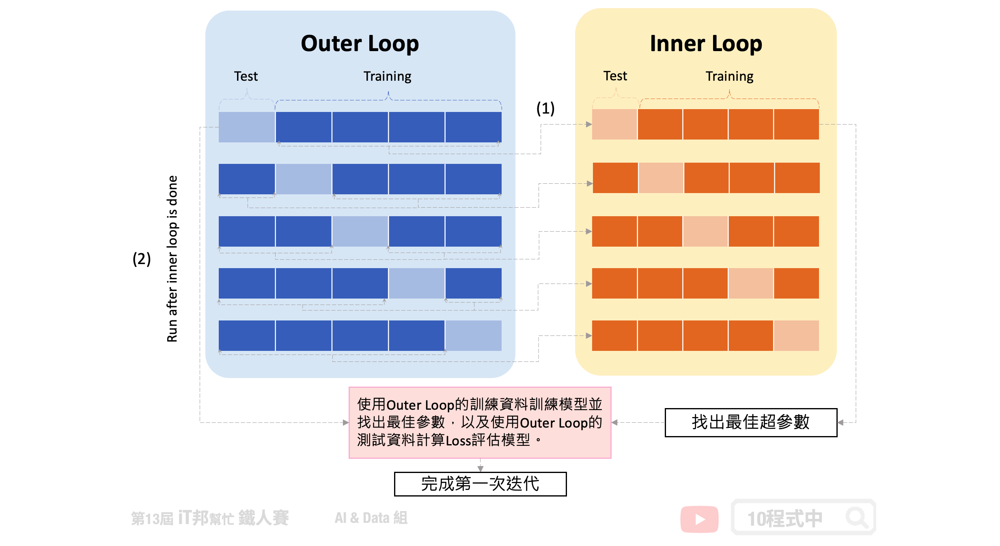
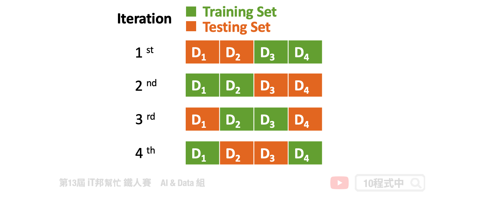
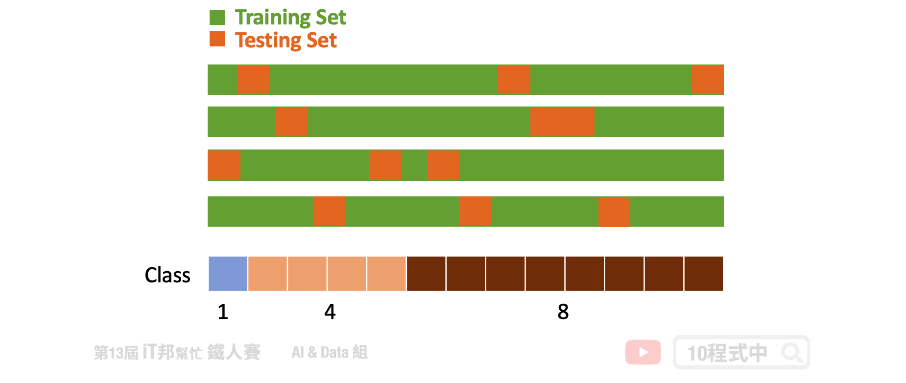

# [Day 26] 交叉驗證 K-Fold Cross-Validation
## 今日學習目標
- 了解 K-Fold 各種不同變形
    - K-Fold Cross-Validation
    - Nested K-Fold Cross Validation
    - Repeated K-Fold
    - Stratified K-Fold
    - Group K-Fold

## 前言
交叉驗證又稱為樣本外測試，是資料科學中重要的一環。透過資料間的重複採樣過程，用於評估機器學習模型並驗證模型對獨立測試數據集的泛化能力。在今天的文章中我們將詳細的來介紹每一種 K-Fold 變型。

## K-Fold Cross-Validation
在 K-Fold 的方法中我們會將資料切分為 K 等份，K 是由我們自由調控的，以下圖為例：假設我們設定 K=10，也就是將訓練集切割為十等份。這意味著相同的模型要訓練十次，每一次的訓練都會從這十等份挑選其中九等份作為訓練資料，剩下一等份未參與訓練並作為驗證集。因此訓練十回將會有十個不同驗證集的 Error，這個 Error 通常我們會稱作 loss 也就是模型評估方式。模型評估方式有很多種，以回歸問題來說就有 MSE、MAE、RMSE...等。最終把這十次的 loss 加總起來取平均就可以當成最終結果。透過這種方式，不同分組訓練的結果進行平均來減少方差，因此模型的性能對數據的劃分就不會那麼敏感。

[參考](https://www.datavedas.com/K-Fold-cross-validation/)

- [[scikit-learn] K-Fold](https://scikit-learn.org/stable/modules/generated/sklearn.model_selection.KFold.html#sklearn.model_selection.KFold)

## Nested K-Fold Cross Validation
此方法為 K-Fold 的變型，Nested 意指雙迴圈(巢狀)的意思。分別有外層迴圈(Outer Loop)為一般正常的 K-Fold。唯一不同的是我們在每一次迭代中會將外層 K-Fold 的訓練集拿出來再進入到內層迴圈(Inner Loop)再做一次 K-Fold。由下圖可以看到，(1)我們可以在第一個外層回圈中將訓練資料又切為五份訓練集和測試集，內層圈透過 Grid Search 等演算法來尋找最佳超參數。等找到最好的模型超參數後，我們再拿(2)外層回圈的測試資料進行模型評估並計算 loss。最終我們會得到五個測試集 loss 的平均作為交叉驗證模型評估結果。

- [[scikit-learn] Nested K-Fold](https://scikit-learn.org/stable/auto_examples/model_selection/plot_nested_cross_validation_iris.html)

## Repeated K-Fold
另一個 K-Fold 變型為 Repeated K-Fold 顧名思義就是重複 n 次 K-Fold cross-validation。假設 K=2、n=2 代表 2-fold cross validation，在每一回合又會將資料將會打亂得到新組合。因此最終會得到 4 組的資料，意味著模型將訓練四遍。此種方法會確保每次組合的隨機資料並不會重複。簡單來說執行 K-Fold 交叉驗證，然後重新洗牌數據，然後再次執行 K-Fold。

- [[scikit-learn] RepeatedKFold](https://scikit-learn.org/stable/modules/generated/sklearn.model_selection.RepeatedKFold.html#sklearn.model_selection.RepeatedKFold)

## Stratified K-Fold
分層交叉驗證，每個 Fold 都是按照類別的比例抽出來的。假設這個分類任務一共有三個類別A、B、C，它們的比例是1:4:8。那麼每個fold中的A、B、C的比例也必須是1:4:8。其實現方式也非常簡單，首先依序把A、B、C類別的數據隨機分成k組，最後再把它們合併依照比例起來，就得到了k組滿足1:2:10的數據了。

**優點**:

1. 優於一般的 K-Fold 因為test set能充分代表整體數據。
2. 預測結果的方差也會變小，使得交叉驗證的 error 更可靠。
3. 對於資料不平衡的數據很有用

**缺點**:

1. 大多實例都以分類問題為主

- [[scikit-learn] StratifiedKFold](https://scikit-learn.org/stable/modules/generated/sklearn.model_selection.StratifiedKFold.html#sklearn.model_selection.StratifiedKFold)
- [[scikit-learn] StratifiedShuffleSplit](https://scikit-learn.org/stable/modules/generated/sklearn.model_selection.StratifiedShuffleSplit.html#sklearn.model_selection.StratifiedShuffleSplit)

## Group K-Fold
此做法為了避免取連續的資料而造成測試集或驗證集偏向某一特別的狀況而造成過度擬和訓練集，反而在未看過的資料下表現不好。Group K-Fold 為了避免此情況發生，它切割資料時有效的從資料集中每個區塊隨機挑選作為驗證集。同時保證每一個 Fold 的驗證集並不會重複的資料。假設你有三個類別，至少驗證集必須從三個不同的分組中抽樣取出，同時確保每一個 Fold 所抽出來的這三個分組並不會重複。

- [[scikit-learn] GroupKFold](https://scikit-learn.org/stable/modules/generated/sklearn.model_selection.GroupKFold.html#sklearn.model_selection.GroupKFold)

> 本系列教學內容及範例程式都可以從我的 [GitHub](https://github.com/andy6804tw/2021-13th-ironman) 取得！