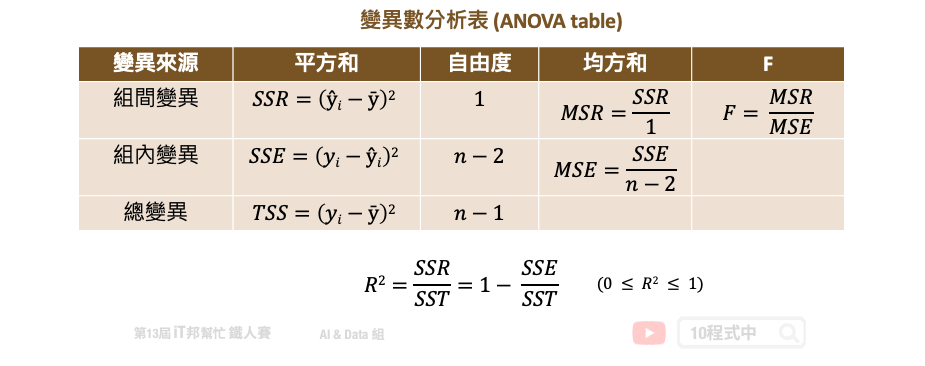

# [Day 27] 機器學習常犯錯的十件事
## 今日學習目標
- 探討機器學習常犯的十個錯誤

## 前言
人工智慧近年來成為任何產業熱門的話題之一，各公司積極地導入機器學習技術協助產業 AI 化。例如：智慧醫療、智慧交通、智慧製造......等。正是因為 AI 技術的創新與普及，訓練機器學習模型再也不是理工背景的人才能做的事。此外隨著 Python 開發社群茁壯，許多開源的 AI 套件如雨後春筍般的出現大大降低了機器學習建模的門檻。在今天的內容中我想藉由鐵人賽來跟大家分享機器學習常犯錯的十件事，並且從資料面與模型面的角度來探討機器學習應該注意的幾件事。尤其是在初學階段，因缺乏經驗往往會犯一些無可避免的錯誤。所以這篇文章將點出十個機器學習中常犯的隱形錯誤。

- 資料面
  - 資料收集與處理不當
  - 訓練集與測試集的類別分佈不一致
  - 沒有資料視覺化的習慣
  - 使用 LabelEncoder 為特徵編碼
  - 資料處理不當導致資料洩漏


- 模型面
  - 僅使用測試集評估模型好壞
  - 在沒有交叉驗證的情況下判斷模型性能
  - 分類問題僅使用準確率作為衡量模型的指標
  - 迴歸問題僅使用 R2 分數評估模型好壞
  - 任何事情別急著想用 AI 解決

## 1. 資料收集與處理不當
機器學習首要的步驟是定義問題，當確定目標與方向後即可開始搜集資料。相信大家都知道現實生活中的資料得來不易，即使從資料庫取得了這些資料後我們還需要花大量的時間進行資料清洗。所謂的資料清洗是資料庫當中可能會有缺失值，例如：NA、Inf、NaN、NULL。

- NA：表示缺失值，是 Not Available 的縮寫。
- Inf：表示無窮大，是 Infinite 的縮寫。
- NaN：表示非數值，是 Not a Number 的縮寫。
- NULL：表示空值，即沒有內容。

當資料都完成了前處理後，即可開始建立模型與評估模型。但是當訓練出來的模型表現不好有很多的因素。大家最常做的是替換模型演算法，或是嘗試不同的模型超參數取得一個最佳的結果。但是在進行這些做之前，建議大家先把關注的點回到資料處理面。模型訓練不好的其中一個因素是資料的標籤收集不當。Landing.ai 執行長吳恩達也曾經說過當一個小資料集存在著錯誤標籤時，模型很難給出一個正確的輸出。因為資料間夾帶了雜訊往往會使的模型存在著一些偏差，導致訓練結果不穩定。因此筆者建議模型訓練不好的時候，可以回頭觀察資料是否存在一些錯誤。而不是一昧的調整模型演算法與超參數。


## 2. 訓練集與測試集的類別分佈不一致
在分類的資料中，初學者常見的錯誤是忘記使用分層抽樣 (stratify) 來對訓練集和測試集進行切割。當測試集的分佈盡可能與訓練相同情況下，模型才更有可能得到更準確的預測。然而在分類的問題中，我們必須更關注每個類別的資料分佈比例。以下舉個例子：假設我們有三個標籤的類別，而這三個類別的分佈比例分別為 4:3:3。同理我們在進行資料切割的時候必須確保訓練集與測試集需要有相同的資料分佈比例。

大家應該都使用過 Sklearn 的 `train_test_split` 進行資料切割。在此方法中 Sklearn 提供了一個 `stratify` 參數達到分層隨機抽樣的目的。特別是在原始數據中樣本標籤分佈不均衡時非常有用，一些分類問題可能會在目標類的分佈中表現出很大的不平衡：例如，負樣本與正樣本比例懸殊(信用卡盜刷預測、離職員工預測)。以下用紅酒分類預測來進行示範，首先我們不使用 `stratify` 隨機切割資料並查看資料切割前後的三種類別比例。

```py
import pandas as pd
from sklearn.datasets import load_wine
from sklearn.model_selection import train_test_split

X, y = load_wine(return_X_y=True)

# 查看全部資料三種類別比例
pd.Series(y).value_counts(normalize=True)
```

```
# 全部資料三種類別比例
1    0.398876
0    0.331461
2    0.269663
dtype: float64
```

```py
# 實驗一: 不使用 stratify 進行切割資料
X_train, X_test, y_train, y_test = train_test_split(X, y)


# 查看訓練集三種類別比例
pd.Series(y_train).value_counts(normalize=True)
# 查看測試集三種類別比例
pd.Series(y_test).value_counts(normalize=True)
```

```
# 訓練集三種類別比例
1    0.390977
0    0.330827
2    0.278195
dtype: float64

# 測試集三種類別比例
1    0.511111
0    0.266667
2    0.222222
dtype: float64
```

從上面切出來的訓練集與測試集可以發現三個類別的資料分佈比例都不同。因此我們可以使用 `stratify` 參數再切割一次。

```py
# 實驗二: 使用 stratify 進行切割資料
X_train, X_test, y_train, y_test = train_test_split(X, y, stratify=y)

# 查看訓練集三種類別比例
pd.Series(y_train).value_counts(normalize=True)
# 查看測試集三種類別比例
pd.Series(y_test).value_counts(normalize=True)
```

```
# 訓練集三種類別比例
1    0.400000
0    0.333333
2    0.266667
dtype: float64

# 測試集三種類別比例
1    0.398496
0    0.330827
2    0.270677
dtype: float64
```

我們可以發現將 `stratify` 設置為目標 (y) 在訓練和測試集中產生相同的分佈。因為改變的類別的比例是一個嚴重的問題，可能會使模型更偏向於特定的類別。因此訓練資料的分佈必須要與實際情況越接近越好。

## 3. 沒有資料視覺化的習慣
資料視覺化的好處多多，在本系列文章 [[Day 3] 你真了解資料嗎？試試看視覺化分析吧！](https://ithelp.ithome.com.tw/articles/10264416) 與 [[Day 22] Python 視覺化解釋數據 - Plotly Express](https://ithelp.ithome.com.tw/articles/10277258) 講解了許多 Python 資料視覺化的技巧。資料視覺化可以幫助我們分析與統計資料的型態，往往有好的資料清洗與前處理對模型預測結果會有大幅的提升。有興趣的讀者可以參考[安斯庫姆四重 (Anscombe’s quartet)](https://zh.wikipedia.org/wiki/%E5%AE%89%E6%96%AF%E5%BA%93%E5%A7%86%E5%9B%9B%E9%87%8D%E5%A5%8F)。他主要是是透過四個小資料集並透過視覺化與統計來觀察，並說明在分析數據前先繪製圖表的重要性，以及離群值對統計的影響之大。

## 4. 使用 LabelEncoder 為特徵編碼
通常我們要為類別的特徵進行編碼，直覺會想到 Sklearn 的 [LabelEncoder](https://scikit-learn.org/stable/modules/generated/sklearn.preprocessing.LabelEncoder.html)。但是如果一個資料集中有多個特徵是屬於類別型的資料，豈不是很麻煩?必須要一個一個呼叫 LabelEncoder 分別為這些特徵進行轉換。如果你看到這邊有同感的，在這裡要告訴你事實並非如此！我們看看 在官方文件下 LabelEncoder 的描述：

> This transformer should be used to encode target values, i.e. y, and not the input X.

簡單來說 LabelEncoder 只是被用來編碼輸出項 y 而已的！你還在用它來編碼你的每個 x 嗎？（暈

那麼我們該用什麼方法來編碼有順序的類別特徵呢？如果你仔細閱讀有關編碼分類特徵的 Sklearn 用戶指南，你會看到它清楚地說明：

> To convert categorical features to integer codes, we can use the OrdinalEncoder. This estimator transforms each categorical feature to one new feature of integers (0 to n_categories - 1)

看到這邊大家應該知道閱讀官方文件的重要性吧！官方文件中建議 x 項的輸入特徵可以採用 [OrdinalEncoder](https://scikit-learn.org/stable/modules/generated/sklearn.preprocessing.OrdinalEncoder.html) 一次為所有特徵依序做 Label Encoding。OrdinalEncoder 編碼器的使用方式如下：

```py
from sklearn.preprocessing import OrdinalEncoder
enc = OrdinalEncoder()
X = [['Male', 1], ['Female', 3], ['Female', 2]]
enc.fit(X)

print(enc.categories_)
enc.transform([['Female', 3], ['Male', 1]])
```

```
[array(['Female', 'Male'], dtype=object), array([1, 2, 3], dtype=object)]
array([[0., 2.],
       [1., 0.]])
```

以上的範例是 X 有三筆資料，每筆資料都有兩個特徵。我們可以發現第一個特徵是性別 Male 與 Female，因此 OrdinalEncoder 會依造字母開頭做排序 Female 編碼為 0 而 Male 編碼為 1。另外第二個特徵為數字 1、2、3，同理依序為他們編碼成 0、1、2。只需閱讀官方文檔和用戶指南，你就可以了解很多關於 Sklearn 的知識！是不是很棒～

## 5. 資料處理不當導致資料洩漏
資料洩漏 (data leakage) 是個隱形殺手，它會在不知不覺中影響模型預測結果。其發生的時機在於你在訓練過程中，不應該將測試的資料的資訊洩漏到訓練過程中。它會造成模型給出一個非常樂觀的結果，即使在交叉驗證中也是如此，但在對實際新數據進行測試時表現會非常地糟糕。

資料洩漏最常發生於資料前處理的階段，尤其是當你的訓練集和測試集尚未切割的時候。Sklearn 提供了許多資料前處理的方法，例如: 缺失值補值(imputers)、正規化 (normalizers)、標準化(standardization)以及對數(log) 轉換...等。這些轉換器都會依賴於你輸入資料的分佈，並依照此分佈做相對應的擬合。

舉例來說，我們在做標準化時(StandardScaler)透過從每筆資料中減去平均值並將其除以標準偏差來獲得縮放後的數據。我們使用 `fit()` 方法在所有資料集 X 上做轉換，並使得轉換器學習每個特徵的整個分佈的平均值和標準差。這些資料轉換後如果再將這些數據拆分為訓練集和測試集，則訓練集會受到污染。因為 StandardScaler 從實際分佈中洩露了測試集重要訊息，一般來說我們不能將測試集的分佈情況與訓練集混在一起。雖然我們希望訓練集的分佈與實際測試集的分佈要越接近越好，因為使得模型表現結果穩定。

雖然我們把測試集與訓練集混在一起並做轉換，這一步驟對我們來說可能沒什麼。但是對於 Sklearn 強大的演算法，可能會透過這個遺漏測試集的分佈的訊息把模型擬合的很好。屆時模型訓練完成後，測試集不夠新穎，無法在實際看不見的數據上測試模型的性能。

最簡單的解決辦法，就是不要使用 `fit()` 一次轉換所有的資料。在做任何資料轉換之前要先確保訓練集與測試集已經完整地被切開。即使切開後也不要再拿測試集呼叫 `fit()` 或 `fit_transform()`，這一樣會導致相同問題發生。因為訓練集和測試集必須進行相同的轉換，依照官方的範例我們必須先使用 `fit_transform()` 在訓練集上進行擬合與轉換。這確保了轉換器僅從訓練集學習，從中找出參數例如平均值與變異數並同時對其進行變換。接著使用 `transform()` 方法在測試資料上進行轉換，根據從訓練數據中學到的訊息進行轉換。

```py
from sklearn.datasets import load_iris
from sklearn.model_selection import train_test_split
from sklearn.preprocessing import StandardScaler

X, y = load_iris(return_X_y=True)
X_train, X_test, y_train, y_test = train_test_split(X, y, stratify=y, random_state=44)
scaler = StandardScaler()
X_train_scaled = scaler.fit_transform(X_train)
X_test_scaled = scaler.transform(X_test)
```

更強大的解決方案是使用 Sklearn 內建的 pipeline，它能夠保護模型免於資料洩漏的問題。此方法能夠確保訓練資料僅參與轉換擬合與模型訓練，而測試資料僅用於計算並驗證模型。


## 6. 僅使用測試集評估模型好壞
如果你的測試資料 R2 score 得到了 0.85 就代表很好了嗎？不盡然！儘管有高的測試分數通常意味著模型表現佳，但在解釋測試結果時仍有一些重要的注意事項。首先最重要的，無論分數值如何測試集的分數一定要與訓練集相比較才能確保模型訓練好與壞。當你的模型訓練集分數高於測試集的分數，並且兩者都足夠高以滿足專案的目標期望時這代表你訓練了一個好模型。然而這並不意味著訓練和測試分數之間的差異越大越好。舉個例子，若訓練集的 R2 score 為 0.85 測試集為 0.8 即代表模型既不過度擬合(overfit)也不欠擬合(underfit)。但是如果訓練集 0.9 測試集 0.7 的時候，你的模型就是過擬合。其原因是該模型沒有在訓練期間進行泛化，而是記住了一些訓練數據，從而導致測試分數低得多。

在判斷訓練集與測試集 𝑅2 分數差異時，雖然沒有固定的比例，但有一些經驗法則可以幫助你更好地評估模型是否過擬合：

- **5%~10%** 差異：可接受，表示模型可能泛化良好。
- **10%~20%** 差異：需注意，可能過擬合。
- **>20%** 差異：嚴重過擬合，模型需要進一步調整。

**舉例：**

- 如果你的訓練集 𝑅 2 = 0.9，而測試集 𝑅 2 = 0.88 ，這意味著模型的差異只有 2%，模型的泛化能力通常是好的。
- 但是如果訓練集 𝑅 2 = 0.95，測試集 𝑅 2 = 0.6，那麼差異為 35%，這就表明模型很可能過擬合。

!!! note

    **需要注意的幾點：**
    
    1. 行業和數據類型差異：不同應用領域和數據集的特性可能會對 𝑅2 分數期望有所不同，有些應用即使有 10-15% 的差異也能被接受，而有些應用（如醫療、金融）則要求更高的準確性。

    2. 多次評估：建議使用交叉驗證來獲取更多穩定的評估指標，而不僅僅依賴一次的訓練/測試集結果。


在大多數任務中你將會看到許多人使用 tree-based 模型或是整體學習模型 (ensemble models)。例如在隨機森林演算法當中如果它們的樹深度太深，往往會獲得非常高的訓練分數，從而導致過度擬合。另外也有測試集的分數比訓練集高的情況，若發生此情況時通常都會感覺是不是做錯了什麼。這種情況的主要原因是資料洩漏，也就是上一節我們討論的情況。或是你的測試資料筆數太少，沒辦法足以驗證模型好壞。

另外有時候我們也會得到在訓練集有很好的表現但測試集無敵差的情況。當訓練和測試分數差異很大時，問題往往與測試集有關而不是過度擬合。這時候你可能要檢查資料預處理的方式是否一致 (像是取 log 或 scale)，或是只是忘記對測試集做轉換處理。

這裡做一個小結，總之在訓練好模型時請仔細檢查訓練和測試分數之間的差距。並且可以透過此評估方式檢視模型是否過擬合，同時也能進行模型條參或是選擇最佳的資料預處理方式。並為最終的模型做最佳的準備。

## 7. 在沒有交叉驗證的情況下判斷模型性能
我想大家應該都熟練掌握了 overfitting 這個議題。這是機器學習中一個迫切問題，並已經設計了無數個方法來解決它。最基本的方法是將一部分數據作為測試集來模擬和測量模型在看不見的數據上的性能。但是我們可以調整模型的超參數，直到模型在該特定測試集上達到最高分數，這又意味著某種含義的過度擬合。因此我們可以會將完整數據的另一部分作為`驗證集`再次解決這個問題。模型將在訓練數據上進行訓練，並在驗證集上微調其參數，並在測試集上進行最終評估。


但是將我們寶貴的數據分成三組意味著模型可以學習的數據量更少。此外模型的整體預測性能將取決於那對特定的訓練集和驗證集。因此在進行機器學習時最常使用 K-Fold cross-validation 解決上述問題。詳細內容可以參考我的前兩天文章[[Day 25] 交叉驗證 Cross-Validation 簡介](https://ithelp.ithome.com.tw/articles/10278851)以及[[Day 26] 交叉驗證 K-Fold Cross-Validation](https://ithelp.ithome.com.tw/articles/10279240)。根據我們設定的 K 值，可以完整的將數據被分成 K 組 folds，對於每個 folds 每次模型訓練會把 K-1 組作為訓練集，而剩下的被歸類為驗證集。當模型交叉驗證結束後，訓練集所有資料會被完整的訓練。


## 8. 分類問題僅使用準確率作為衡量模型的指標
在預設的情況下所有 Sklearn 分類器在呼叫 `score()` 函數時都使用準確度作為評分方法。由於準確率的計算方式簡單與容易理解，因此經常會看到初學者廣泛使用它來判斷其模型的性能。不幸的是這種一般準確率的評估方式只對類別平衡的二元分類問題有用。

然而在其他的狀況下它是一個誤導性的指標，即使是表現最差的模型也可能背後隱藏著高準確度的分數。舉例來說有個偵測垃圾郵件的模型它的準確率 90%，但是實際上它根本無法偵測到垃圾郵件。這是為什麼？由於垃圾郵件並不常見，分類器可以檢測所有非垃圾郵件，即使分類器完全無法達到其目的這也可以提高其準確性。因為這個分類器僅可以分類這些正常郵件，稀少的垃圾郵件根本變認不出來。

對於多元類分類的問題更是應該注意你的模型評估指標。如果達到 80% 的準確率，是否意味著模型在預測類別1、類別2、類別3甚至所有類時一樣準確呢？一般的準確率永遠無法回答此類問題，但幸運的是其他分類指標提供了更多的訊息指標。它就是[混淆矩陣](https://scikit-learn.org/stable/modules/generated/sklearn.metrics.confusion_matrix.html)(confusion matrix)。

```py
from sklearn.metrics import confusion_matrix
y_true = [2, 0, 2, 2, 0, 1]
y_pred = [0, 0, 2, 2, 0, 2]
confusion_matrix(y_true, y_pred)
```

```
array([[2, 0, 0],
       [0, 0, 1],
       [1, 0, 2]])
```


組成混淆矩陣的四個元素分別有 TP、TN、FP、FN。基本上混淆矩陣會拿這四個指標做參考，同時算出來的分數也更能去評估你的模型訓練的結果。此外我們可以利用混淆矩陣來計算 Precision、Recall、Accuracy 等分數。

- TP(True Positive): 正確預測成功的正樣本，例如真實答案(Ground True)是貓，成功的把一張貓的照片預測成貓，即為TP
- TN(True Negative): 正確預測成功的負樣本，成功的把一張狗的照片標示成不是貓，即為TN
- FP(False Positive): 錯誤預測成正樣本，實際上為負樣本，例如：錯誤的把一張狗的照片預測成貓
- FN(False Negative): 錯誤預測成負樣本，實際上為正樣本，例如：錯誤的把一張貓的照片預測成不是貓

## 9. 迴歸問題僅使用 R2 分數評估模型好壞
在預測連續性數值輸出的迴歸模型中，大家往往會直接呼叫模型提供的評估方法直接計算 `score`。然而這個分數在迴歸模型中是計算 R2 分數，又稱判定係數 (coefficient of determination)。所謂的判定係數是輸入特徵 (x) 去解釋輸出 (y) 的變異程度有多少，其計算公式是：迴歸模型的變異量 (SSR)/總變異量 (TSS) 。用以下變異數分析表（ANOVA table）來說 TSS 就是計算總變異，把每個實際的 y 減去平均數的平方加總起來。而 SSR 就是把所有的模型預測 y 減去平均數的平方加總起來。如果 R2 分數很高越接近 1，表示模型的解釋能力很高。



在學術研究上最直覺的觀念是 R2 分數愈接近 1 越好，也有些人透過一些手段來製造 R2 分數很高的假象，詳細內容可以參考這篇[文章](http://amebse.nchu.edu.tw/new_page_535.htm)。其實只透過 R2 個評估指標就來決定一個模型的好壞是不太好的習慣。更進一步可以使用 MSE、MAE 等殘差的評估值標來看每筆資料實際值與預測值的誤差。或是使用相對誤差來觀察預測模型的可信度。此外筆者還建議可以試著把每筆資料的真實 y 與模型預測的 ŷ 繪製出來，若呈現一條明顯的由左下到右上斜直線，則表示模型所預測的結果與真實答案很相近。


## 10. 任何事情別急著想用 AI 解決
近幾年 AI 的發展想必大家有目共睹，從影像識別到物件辨識的技術有著重大的進展。此外 2016 年 Google Deepmind 團隊的 AlphaGo 首度打敗人類，這也在人機對弈上開啟了一項重要的里程碑。甚至在自然語言方面，歸功於新的模型架構與硬體資源的進步，使得自然語言有重大的突破。看到這麼多 AI 的美好讓大家再次對深度學習點燃希望！只不過 AI 並非萬能，切記！所有的問題並不是將資料收集好，並將資料丟給電腦學習就會得到你想要的結果。大家也許會陷入「為 AI 而 AI」 的迷思，很多的任務其實透過具有規則的專家系統或是傳統演算法就可以達到很不錯的結果。再者我們都對 AI 的技術感到特別歡喜與期待，但是 AI 的黑盒子人類往往不知道模型下一步會產生什麼不可預期的結果。其實 AI 有很多的限制與挑戰，除了建立機器學習模型以外，我們更需要關注的是模型在想什麼。可解釋人工智慧必然是我們要探討的一段課題。AI 與機器人的出現並不是要取代人類，我認為 AI 比較適合扮演輔助人類的重要角色。

> 本系列教學內容及範例程式都可以從我的 [GitHub](https://github.com/andy6804tw/2021-13th-ironman) 取得！
