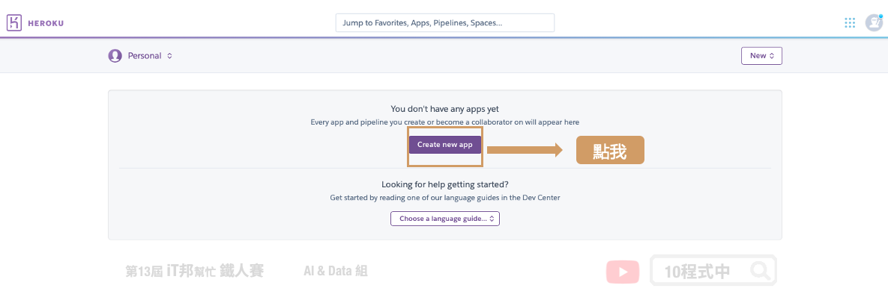
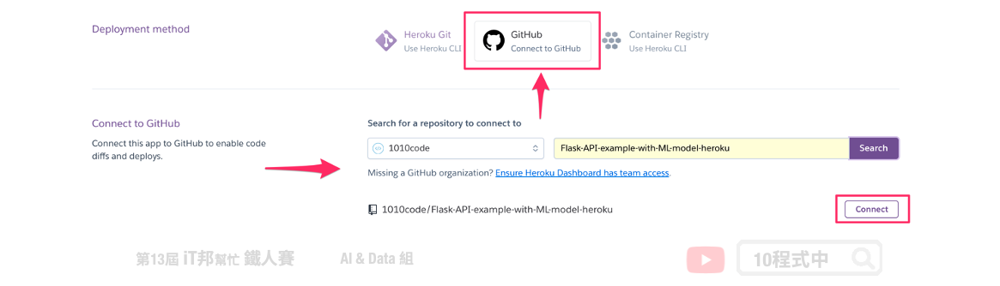
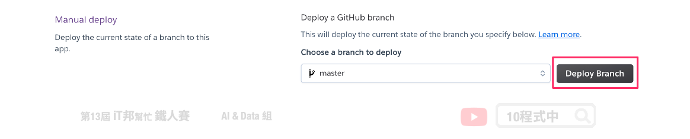
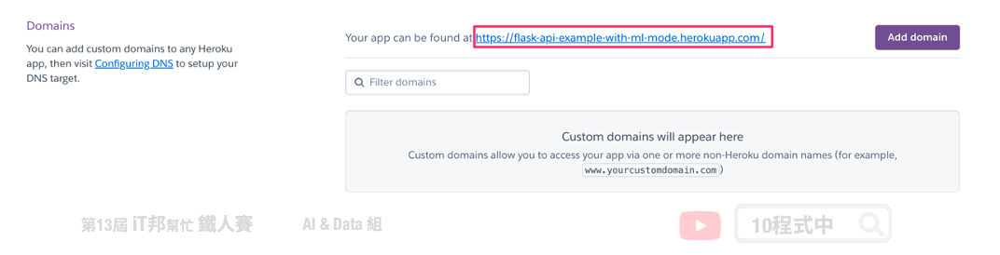

# [Day 30] 使用 Heroku 部署機器學習 API

## 今日學習目標
- 動手部署自己的機器學習 API
- 使用 Heroku 雲端平台部署應用程式

<iframe width="560" height="315" src="https://www.youtube.com/embed/X2ncrARsB70" frameborder="0" allow="accelerometer; autoplay; clipboard-write; encrypted-media; gyroscope; picture-in-picture" allowfullscreen></iframe>

範例程式：[Code](https://github.com/1010code/Flask-API-example-with-ML-model-heroku)


## 前言
開發的最後一哩路`部署應用`。部署 API 必須在一個穩定的伺服器上運行，大多數企業可能會租用雲端的虛擬伺服器。常見的雲端平台三巨頭有 Google Cloud Platform (GCP)、Amazon Web Service (AWS) 以及 Microsoft Azure。以上三家供應商都有提供免費的試用額度以及部署的教學，另外雲端伺服器計費的方式是採用多少付多少的概念收費。若有 GCP 使用需求可以參考我過去所錄製的系列教學影片 [GCP教學-Python](https://www.youtube.com/watch?v=z3bU_MYPlOs&list=PLXSkku8eiD-hcW9N9A6M8Y6Hma8DHBsEJ)。

## Heroku 雲端平台
[Heroku](https://www.heroku.com) 是一個支援多種程式語言的雲平台即服務。並且提供一個~~免費~~(現在要付費了)的雲端服務，這個雲端平台~~一個帳號可以免費建立五個專案~~，雖然是~~免費當然也有使用上的限制。例如：(1) 超過`30分鐘`閒置將會進入睡眠狀態，之後重新啟動 API 時會需要等待一些時間才有回應。(2) `500MB`的儲存空間限制。當然 Heroku 也提供多種語言的部署環境像是 Ruby、Node.js、PHP、Go、Python ...等。~~
本篇文章會教你如何部署 Python 的 Flask API。

## 1. 前置作業
### 1.1) 範例程式碼
這一篇文章將以花朵分類 API 為例，拿一個先已經訓練好的模型進行 Python Flask API 的開發與部署。至於模型的訓練和 Flask API 的詳細內容這邊就不細提，若各位想了解的可以參考昨天的內容 [[Day 29] 使用 Python Flask 架設 API 吧！](https://ithelp.ithome.com.tw/articles/10280422)。另外建議大家可以參考下面這份程式碼進行今天的內容實作，使用 GitHub 並將程式 fork 到自己的帳號中。

- [範例程式碼](https://github.com/1010code/Flask-API-example-with-ML-model-heroku)


> 以下簡單說明專案內部署 Heroku 的重要檔案。

### 1.2 Procfile 設定檔
Procfile 這個檔案是要告訴 Heroku 要如何啟動這個 web app，在 Heroku 裡，執行 Python 要使用 Gunicorn 來啟動 web server。所以在 requirements.txt 裡，請記得要輸入 gunicorn。Procfile 檔案，的內容如下：

```sh
web gunicorn run:app
```

## 2. 部署 Heroku 專案
### 2.1 在 Heroku 建立應用程式
建立帳號後右上角「 New 」中的「 Create new app 」建立第一個應用程式：



### 2.2 專案與 GitHub 連動
這一步驟是將 GitHub 上的專案直接與 Heroku 做連動，你也可以直接 Fork 這個專案直接實作。或是你也可以透過 Heroku CLI 直接將本機的程式碼部署到 Heroku 主機中。部署階段蠻吃大家 Git 版控的能力，基本的教學這裡就不贅述，想了解更多 Git 技巧可以[參考](https://github.com/doggy8088/Learn-Git-in-30-days)。



點選 Enable Automatic Deploys 連動後可以選擇自動部署。當你 GitHub 專案的程式碼有更新時他會自動幫你把更新的程式部署到 Heroku 中。


由於自動更新與部署會有上限次數，當你的專案在 GitHub 更新次數太頻繁。Heroku 就會停止自動發布，這時候你也可以試試手動部署。



## 部署專案
確認以下事情都完成後就可以部署程式囉！記得我們有跟 GitHub 連動，當你的專案 `git push` 後 Heroku 就會幫你自動部署了。你可以從 Activity 內看到部署狀態，也能從右上角 More -> View logs 觀看後台 Log 訊息。或者你也可以從 Deploy 內手動部署也行。

- Python Flask API 程式撰寫 ✅
- 專案內建立 Procfile ✅
- Heroku 建立專案 ✅
- Heroku 與 GitHub連動 ✅

部署完成後你可以在 Settings 內的 Domains 看到你的雲端連結，這個連結點下去就能看到我們的API囉！

> https://flask-api-example-with-ml-mode.herokuapp.com



## 測試 API
昨天已經跟大家介紹 Postman 的使用方式。今天我們就來試試部署在雲端伺服器的結果，基本上測試的方式跟昨天在本機測試的方法一模一樣。打開 Postman 點選 POST 並貼上 API 網址 `https://專案名稱.herokuapp.com/predict`。並模擬前端使用者發送數值 Body -> raw -> JSON 將花朵的四個參數以 JSON 格式傳給後端 API。


> 本系列教學內容及範例程式都可以從我的 [GitHub](https://github.com/andy6804tw/2021-13th-ironman) 取得！