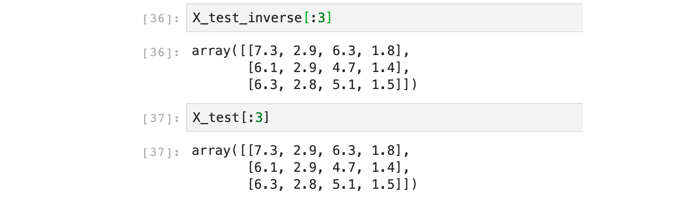

# 咱們一起做資料清理和前處理
## 今日學習目標
- 資料如何清理
    - 什麼是資料清理？
- 資料前處理的方式
    - 為什麼資料要前處理呢？前處裡有何好處？
- 學習 Sklearn 中四種不同資料前處理方式
    - StandardScaler (平均值和標準差)
    - MinMaxScaler(最小最大值標準化)
    - MaxAbsScaler（絕對值最大標準化）
    - RobustScaler

<iframe width="560" height="315" src="https://www.youtube.com/embed/tATr84j1jqA" frameborder="0" allow="accelerometer; autoplay; clipboard-write; encrypted-media; gyroscope; picture-in-picture" allowfullscreen></iframe>

範例程式：[](https://colab.research.google.com/github/andy6804tw/2021-13th-ironman/blob/main/docs/4.咱們一起做資料清理和前處理/4.咱們一起做資料清理和前處理.ipynb)

## 前言
很多演算法對數據範圍非常的敏感。因此為了要讓模型訓練的更強大，通常的做法是對特徵進行調節，使得數據更適合這些演算法。一般來說，我們在做機器學習時往往會做特徵的正規化。


## 載入相關套件

```py
import pandas as pd
import numpy as np
import matplotlib.pyplot as plt
import seaborn as sns
from sklearn.datasets import load_iris

np.set_printoptions(suppress=True)
```

## 1) 載入資料集
今天的範例我們延續昨天的例子，鳶尾花朵資料集進行資料正規化的示範。

```py
iris = load_iris()
df_data = pd.DataFrame(data= np.c_[iris['data'], iris['target']],
                     columns= ['SepalLengthCm','SepalWidthCm','PetalLengthCm','PetalWidthCm','Species'])
df_data
```

## 2) 檢查缺失值
使用 numpy 所提供的函式來檢查是否有 NA 缺失值，假設有缺失值使用 `dropna()` 來移除。使用的時機在於當只有少量的缺失值適用，若遇到有大量缺失值的情況，或是本身的資料量就很少的情況下建議可以透過機器學習的方法補值來預測缺失值。

```py
X = df_data.drop(labels=['Species'],axis=1).values # 移除Species並取得剩下欄位資料
y = df_data['Species']
# checked missing data
print("checked missing data(NAN mount):",len(np.where(np.isnan(X))[0]))
```

輸出結果：
```
checked missing data(NAN mount): 0
```

由於 Sklearn 所提供的資料集非常乾淨，若你收集到的資料有許多的缺失值或是本身資料量就不多的強況下，建議好好的去處理這些缺漏的值。通常補值的方法可分為手動填值與插值法。首先手動填值可以以該欄位所有資料的算術平均數或中位數做填補的依據。再者使用以出現頻率最高的值做填補也是常見的補值方式。另一種差值法是透過時間或空間上的技巧處理這些缺值，例如當資料是有時間序列的因素存在時，可以利用該筆缺失欄位附近的時間點的資料加總並平均。

## 3) 切割訓練集與測試集
我們透過 Sklearn 所提供的 `train_test_split()` 方法來為我們的資料進行訓練集與測試集的切割。在此方法中我們可以設定一些參數來讓我們切割的資料更多樣性。其中 `test_size` 參數就是設定測試集的比例，範例中我們設定 0.3 即代表訓練集與測試集的比例為 7:3。另外預設資料切割的方式是隨機切割 `shuffle=True` 對原始數據進行隨機抽樣，以保證隨機性。若想要每次程式執行時切割結果都是一樣的可以設定亂數隨機種子 `random_state` 並給予一個隨機數值。最後一個是 `stratify` 分層隨機抽樣，特別是在原始數據中樣本標籤分佈不均衡時非常有用。使用時機是確保分類問題 y 的類別數量分佈要與原資料集一致。以免資料集切割不平均導致模型訓練時有很大的偏差。

```py
from sklearn.model_selection import train_test_split

X_train, X_test, y_train, y_test = train_test_split(X, y, test_size=0.3, random_state=42, stratify=y)

print('train shape:', X_train.shape)
print('test shape:', X_test.shape)
```

輸出結果：
```
train shape: (105, 4)
test shape: (45, 4)
```


## Standardization平均&變異數標準化
將所有特徵標準化，也就是高斯分佈。使得數據的平均值為 0，方差為 1。適合的使用時機於當有些特徵的方差過大時，使用標準化能夠有效地讓模型快速收斂。

```py
from sklearn.preprocessing import StandardScaler

scaler = StandardScaler()
X_train_scaled = scaler.fit_transform(X_train)
```

```py
# scaled之後的資料零均值，單位方差  
print('資料集 X 的平均值 : ', X_train.mean(axis=0))
print('資料集 X 的標準差 : ', X_train.std(axis=0))

print('\nStandardScaler 縮放過後訓練集的平均值 : ', X_train_scaled.mean(axis=0))
print('StandardScaler 縮放過後訓練集的標準差 : ', X_train_scaled.std(axis=0))
```

輸出結果：
```
資料集 X 的平均值 :  [5.87333333 3.0552381  3.7847619  1.20571429]
資料集 X 的標準差 :  [0.85882164 0.45502087 1.77553646 0.77383751]

StandardScaler 縮放過後訓練集的平均值 :  [ 0. -0. -0. -0.]
StandardScaler 縮放過後訓練集 X 的標準差 :  [1. 1. 1. 1.]
```

訓練集的 Scaler 擬合完成後，我們就能做相同的轉換在測試集上。

```py
X_test_scaled = scaler.transform(X_test)

print('\nStandardScaler 縮放過後測試集的平均值 : ', X_test_scaled.mean(axis=0))
print('StandardScaler 縮放過後測試集的標準差 : ', X_test_scaled.std(axis=0))
```

輸出結果：
```
StandardScaler 縮放過後測試集的平均值 :  [0.40925926 0.44259259 0.44750958 0.45185185]
StandardScaler 縮放過後測試集的標準差 :  [0.20457725 0.15915694 0.29647499 0.30224923]
```

如果想將轉換後的資料還原可以使用 `inverse_transform()` 將數值還原成原本的輸入。

```py
# 將縮放的資料還原
X_test_inverse = scaler.inverse_transform(X_test_scaled)
```



## MinMaxScaler最小最大值標準化
在 MinMaxScaler 中是給定了一個明確的最大值與最小值。每個特徵中的最小值變成了0，最大值變成了1。數據會縮放到到[0,1]之間。

```py
from sklearn.preprocessing import MinMaxScaler

scaler = MinMaxScaler()
X_train_scaled = scaler.fit_transform(X_train)
```

```py
# scaled 之後的資料最小值、最大值  
print('資料集 X 的最小值 : ', X_train.min(axis=0))
print('資料集 X 的最大值 : ', X_train.max(axis=0))

print('\nStandardScaler 縮放過後訓練集的最小值 : ', X_train_scaled.min(axis=0))
print('StandardScaler 縮放過後訓練集的最大值 : ', X_train_scaled.max(axis=0))
```

輸出結果：
```
資料集 X 的最小值 :  [4.3 2.  1.1 0.1]
資料集 X 的最大值 :  [7.9 4.4 6.9 2.5]

StandardScaler 縮放過後訓練集的最小值 :  [0. 0. 0. 0.]
StandardScaler 縮放過後訓練集的最大值 :  [1. 1. 1. 1.]
```

```py
X_test_scaled = scaler.transform(X_test)

print('\nStandardScaler 縮放過後測試集的最小值 : ', X_test_scaled.min(axis=0))
print('StandardScaler 縮放過後測試集的最大值 : ', X_test_scaled.max(axis=0))
```

```
StandardScaler 縮放過後測試集的最小值 :  [ 0.02777778  0.125      -0.01724138  0.04166667]
StandardScaler 縮放過後測試集的最大值 :  [0.83333333 0.83333333 0.89655172 0.95833333]
```

## MaxAbsScaler絕對值最大標準化
MaxAbsScaler 與 MinMaxScaler 類似，所有數據都會除以該列絕對值後的最大值。 數據會縮放到到[-1,1]之間。

```py
from sklearn.preprocessing import MaxAbsScaler

scaler = MaxAbsScaler().fit(X)
X_scaled = scaler.transform(X)
```

```py
X_test_scaled = scaler.transform(X_test)
```

## RobustScaler
可以有效的縮放帶有 outlier 的數據，透過 Robust 如果數據中含有異常值在縮放中會捨去。

```py
from sklearn.preprocessing import RobustScaler

scaler = RobustScaler().fit(X)
X_scaled = scaler.transform(X)
```

```
X_test_scaled = scaler.transform(X_test)
```

本系列教學內容及範例程式都可以從我的 [GitHub](https://github.com/andy6804tw/2021-13th-ironman) 取得！