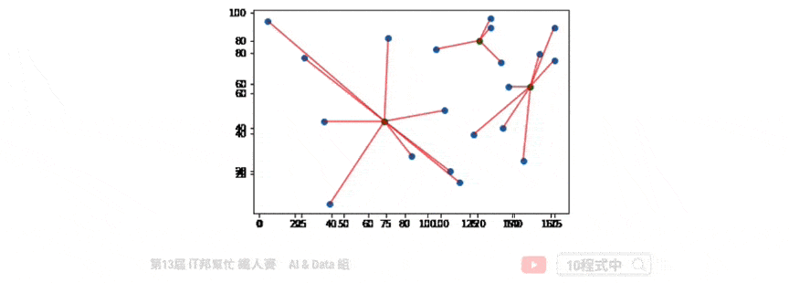
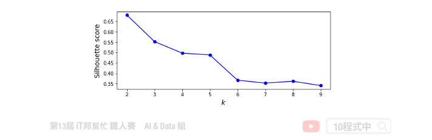

# [Day 6] 非監督式學習 K-means 分群
## 今日學習目標
- 非監督式學習
    - 何謂非監督式學習? 集群分析?
- 分群演算法介紹
    - K-means 分群分類演算法

<iframe width="560" height="315" src="https://www.youtube.com/embed/AYGEgkDZCc8" frameborder="0" allow="accelerometer; autoplay; clipboard-write; encrypted-media; gyroscope; picture-in-picture" allowfullscreen></iframe>

<iframe style="border-radius:12px" src="https://open.spotify.com/embed/episode/3qCNVvZcKo5cea7Smnl9ps?utm_source=generator&theme=0" width="100%" height="152" frameBorder="0" allowfullscreen="" allow="autoplay; clipboard-write; encrypted-media; fullscreen; picture-in-picture" loading="lazy"></iframe>

範例程式：[](https://colab.research.google.com/github/andy6804tw/2021-13th-ironman/blob/main/docs/6.非監督式學習k-means分群/6.非監督式學習k-means分群.ipynb)

## 非監督式學習(Un-supervised learning)
在訓練過程中沒有所謂的標準答案，故機器會自己從資料群中找出一套分群的法則。非監督式學習的優點是不需要事先以人力標籤，只給定特徵讓機器想辦法會從中找出規律。常見的非監督式的分群演算法有 K-means，它根據物以類聚的原理目標是根據特徵把資料樣本分為 K 群。其中在訓練模型時僅須對機器提供輸入的特徵，並利用分群演算法自動從這些特徵中找出鄰近的集群中心作為該類別。


## K-means 演算法
透過分群分類演算法我們能夠將多種維度的資料進行分類。K-means 演算法的概念很簡單也非常容易實作，僅一般加減乘除就好不需複雜的計算公式。

1. 初始化: 指定 K 個分群，並隨機挑選 K 個資料點的值當作群組中心值 
2. 分配資料點: 將每個資料點設為距離最近的中心
3. 計算平均值: 重新計算每個分群的中心點

> 重複步驟2、3，直到資料點不再變換群組為止



## [程式實作]

## 載入相關套件

```py
import pandas as pd
import numpy as np
import matplotlib.pyplot as plt
import seaborn as sns
from sklearn.datasets import load_iris
```

## 1) 載入資料集
我們今天要實作分群分類的問題，因此鳶尾花朵資料集非常適合當作範例。其資料集載入方式在第四天有提過，是一樣的內容！

```py
iris = load_iris()
df_data = pd.DataFrame(data= np.c_[iris['data'], iris['target']],
                     columns= ['SepalLengthCm','SepalWidthCm','PetalLengthCm','PetalWidthCm','Species'])
df_data
```

## K-Means
K-means 演算法在 Sklearn 套件中已經幫我們封裝好了，使用者只要呼叫 API 即可將分群分類演算法快速實作。

Parameters:
- n_cluster: K的大小，也就是分群的類別數量。
- random_state: 亂數種子，設定常數能夠保證每次分群結果都一樣。
- n_init: 預設為10次隨機初始化，選擇效果最好的一種來作為模型。
- max_iter: 迭代次數，預設為300代。
    
Attributes:
- inertia_: inertia_：float，每個點到其他叢集的質心的距離之和。
- cluster_centers_： 特徵的中心點 `[n_clusters, n_features]`。
    
Methods:
- fit: K個集群分類模型訓練。
- predict: 預測並回傳類別。
- fit_predict: 先呼叫fit()做集群分類，之後在呼叫predict()預測最終類別並回傳輸出。
- transform: 回傳的陣列每一行是每一個樣本到kmeans中各個中心點的L2(歐幾里得)距離。
- fit_transform: 先呼叫fit()再執行transform()。


```py
from sklearn.cluster import KMeans

kmeansModel = KMeans(n_clusters=3, random_state=46)
clusters_pred = kmeansModel.fit_predict(X)
```

## 評估分群結果
使用者設定 K 個分群後，該演算法快速的找到 K 個中心點並完成分群分類。擬合好模型後我們可以計算各個樣本到該群的中心點的距離之平方和，用來評估集群的成效，其 `inertia` 越大代表越差。

```py
kmeansModel.inertia_
```

輸出結果：
```
78.94084142614602
```

若要查看各群集的中心點，可以參考以下程式碼。

```py
kmeansModel.cluster_centers_
```

輸出結果：
```
array([[5.9016129 , 2.7483871 , 4.39354839, 1.43387097],
       [5.006     , 3.428     , 1.462     , 0.246     ],
       [6.85      , 3.07368421, 5.74210526, 2.07105263]])
```

## 分類結果


## 如何決定K? 
當你手邊有一群資料，且無法一眼看出有多少個中心的狀況。可用使用下面兩種方法做 k-means 模型評估。

- Inertia 計算所有點到每群集中心距離的平方和。
- silhouette scores 側影函數驗證數據集群內一致性的方法。


### 使用 inertia 做模型評估
當K值越來越大，inertia 會隨之越來越小。正常情況下不會取K最大的，一般是取 elbow point 附近作為 K，即 inertia 迅速下降轉為平緩的那個點。

```py
# k = 1~9 做9次kmeans, 並將每次結果的inertia收集在一個list裡
kmeans_list = [KMeans(n_clusters=k, random_state=46).fit(X)
                for k in range(1, 10)]
inertias = [model.inertia_ for model in kmeans_list]
```


### 使用 silhouette scores 做模型評估
另外一個方法是用 silhouette scores 去評估，其分數越大代表分群效果越好。

```py
from sklearn.metrics import silhouette_score
silhouette_scores = [silhouette_score(X, model.labels_)
                     for model in kmeans_list[1:]]
```



本系列教學內容及範例程式都可以從我的 [GitHub](https://github.com/andy6804tw/2021-13th-ironman) 取得！