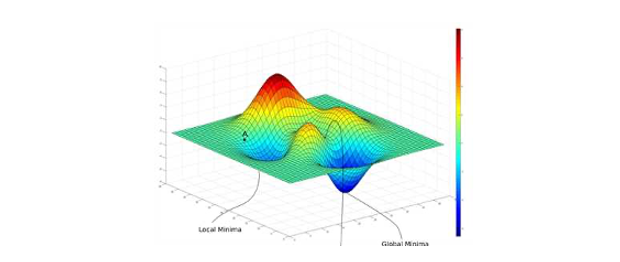
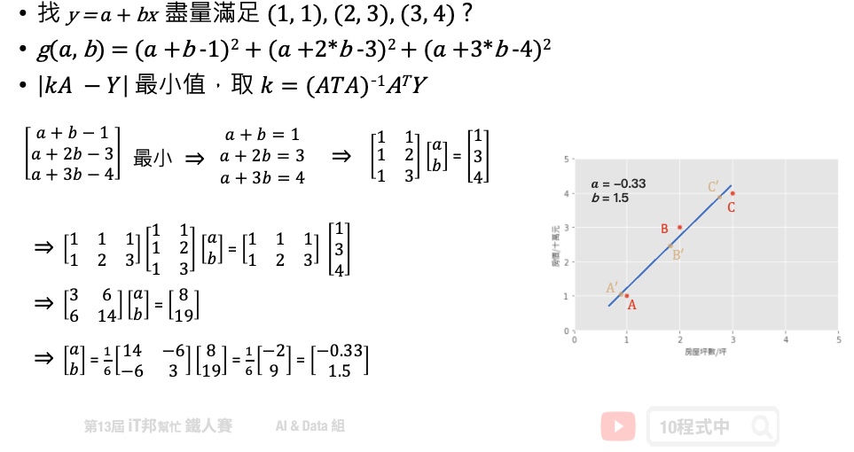
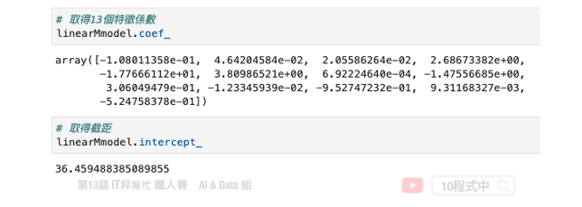
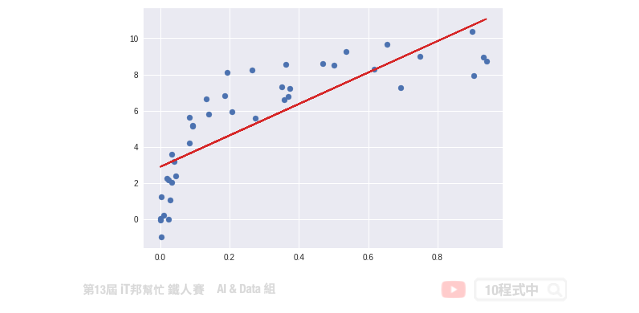
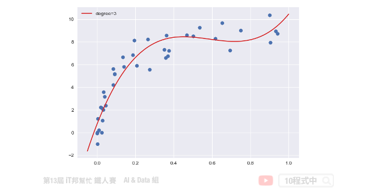
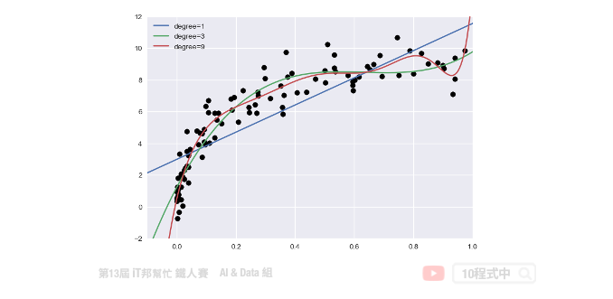
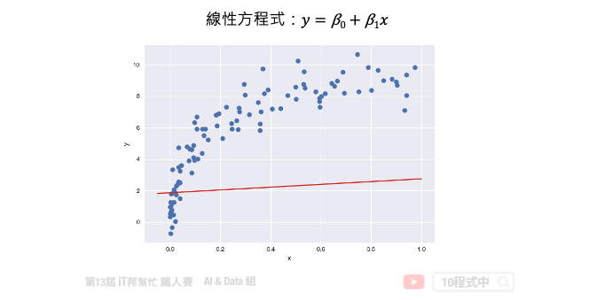
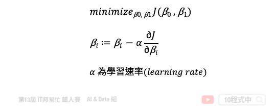
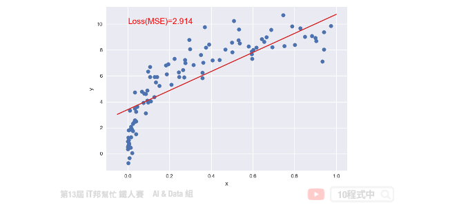

 
# 線性迴歸(Linear Regression)
 ## 今日學習目標
- 認識線性迴歸
    - 透過機器學習來找出一條函式，來最佳化模型
    - 兩種求解方法
- 線性迴歸程式手把手
    - 簡單線性迴歸、多元迴歸、非線性迴歸

<iframe width="560" height="315" src="https://www.youtube.com/embed/L0X1ppgWwAk" frameborder="0" allow="accelerometer; autoplay; clipboard-write; encrypted-media; gyroscope; picture-in-picture" allowfullscreen></iframe>

範例程式：[](https://colab.research.google.com/github/andy6804tw/2021-13th-ironman/blob/main/docs/8.線性迴歸/8.線性迴歸.ipynb)

## 認識線性迴歸
線性迴歸是統計上在找多個自變數和依變數之間的關係所建出來的模型。只有一個自變數(x)和一個依變數(y)的情形稱為簡單線性迴歸大於一個自變數(x<sub>1</sub>,x<sub>2</sub>,...)的情形稱為多元迴歸。

一個簡單線性迴歸: y=ax+b，其中 b：截距(Intercept)，a：斜率(Slope) 為 x 變動一個單位 y 變動的量，如下圖:


迴歸分析的目標函數或稱損失函數(loss function)就是希望找到的模型最終的殘差越小越好，來找參數 a 和 b。

## 兩種求解方法
線性模型最常見的解法有兩種，分別為 Closed-form (閉式解) 與梯度下降 (Gradient descent)。當特徵少時使用 Closed-form 較為適合，使用下面公式來求出 θ 值。我們又可以說線性模型的最小平方法的解即為 Closed-form。若當是複雜的問題時 Gradient descen 較能解決，其原因是大部分的問題其實是沒有公式解的。我們只能求出一個函數 f(x) 使其誤差最小越好。

- Closed-form

 

- Gradient descent

 


 ## Least Square Method (最小平方法)
 假設一個地區的房價與坪數是呈線性關係，並以下圖中的三個點表示。如果我們想透過房子的坪數來預測房價，那麼我們的目標就是找到一條直線，並與座標平面上這三個點的差距越小越好。那這條直線該怎麼找呢？首先我們隨機找一條直線，並計算這三點的 loss。損失函數可以自己定義，假設我們使用 MSE 均方誤差來計算。透過一系列計算我們得到一個 loss 即為 MSE 值。接著我們將這個直線稍稍的轉一個角度後又可以計算一個新的 MSE，此刻我們可以發現 MSE 值又比剛剛更小了。也就是說這一條新的直線能夠更法應出訓練集中 A、B、C 的數據點所反映的房屋坪數與房價之間的線性關係。
 

 
 簡單來說我們在一個二維空間中，我們可以找到無數條直線。現在我們能做的事情就是從這無數條直線中選出一條最佳的當作我們的預測模型，同時它面對這三點的誤差是要最小的。因此我們的目標就是要最小化 MSE 也就是所謂的損失函數 (loss function)。所以整個線性迴歸的目標就是最小化我們的損失函數，其中一個解法就是最小平方法。因為 MSE 等於 1/n 倍的残差平方和 (RSS)，其中分母 n 為常數，不影響極小化故拿掉。因此最終的求解是滿足最小化平方和，使其最小化。經過數學推導後，簡化的公式如下：


### 小試身手
基於上面的公式我們想找出一組參數權重 θ。也就是下圖問題中的 a (θ<sub>0</sub>)、b (θ<sub>1</sub>) 兩參數，使得平面上這三點平方和有極小值。這個函式對 θ<sub>0</sub>, θ<sub>1</sub> 偏做微分設他們為0，接著我們對方程式求解。 此函式只有極小值，因此我們得到的 θ<sub>0</sub>, θ<sub>1</sub> 最小極值的解。



## 範例程式 (房價預測)
### 手刻線性迴歸
我們透過 Sklearn 所提供的房價預測資料集進行線性迴歸模型建模，並採用最小平法。首先為了要驗證我們上面的公式，因此我們先利用 Numpy 套件自己手刻做一系列的矩陣運算求出每一項的係數與截距。

```py
import numpy as np
import pandas as pd
from sklearn.metrics import mean_squared_error
from sklearn.datasets import load_boston

# 載入 Sklearn 房價預測資料集 13個輸入特徵 1個輸出特徵
boston_dataset = load_boston()
# 輸入特徵共13個
X = boston_dataset.data
# 設定截距項 b 權重值為 1 
b=np.ones((X.shape[0], 1))
# 添加常數項特徵，最終有 13+1 個輸入特徵
X=np.hstack((X, b))
# 輸出(房價)
y = boston_dataset.target

# 計算 Beta (@ 為 numpy 中 2-D arrays 的矩陣乘法)
Beta = np.linalg.inv(X.T @ X) @ X.T @ y
y_pred = X @ Beta

# MSE: 21.8948311817292
print('MSE:', mean_squared_error(y_pred, y))
```

計算出來 Beta 後我們再把所有的 X 帶入並做計算，算出來的結果 MSE 為 21.89。最後我們可以試著把 Beta 變數列印出來。總共會有 14 個參數，由 13 個輸入特徵係數與最後一項截距所組成的。

輸出結果：
```
array([-1.08011358e-01,  4.64204584e-02,  2.05586264e-02,  2.68673382e+00,
       -1.77666112e+01,  3.80986521e+00,  6.92224640e-04, -1.47556685e+00,
        3.06049479e-01, -1.23345939e-02, -9.52747232e-01,  9.31168327e-03,
       -5.24758378e-01,  3.64594884e+01])
```

## 使用 Sklearn LinearRegression
線性迴歸簡單來說，就是將複雜的資料數據，擬和至一條直線上，就能方便預測未來的資料。接下來我們一樣使用房價預測資料集，並使用 Sklearn 提供的 LinearRegression 來求解。

Parameters:
- fit_intercept: 是否有截距，如果沒有則直線過原點。

Attributes:
- coef_: 取得係數。
- intercept_: 取得截距。

Methods:
- fit: 放入X、y進行模型擬合。
- predict: 預測並回傳預測類別。
- score: R2 score 模型評估。

```py
import numpy as np
import pandas as pd
from sklearn.linear_model import LinearRegression
from sklearn.metrics import mean_squared_error
from sklearn.datasets import load_boston

# 載入 Sklearn 房價預測資料集 13個輸入特徵 1個輸出特徵
boston_dataset = load_boston()
# 輸入特徵共13個
X = boston_dataset.data
# 輸出(房價)
y = boston_dataset.target

# 訓練模型
linearModel = LinearRegression()
linearModel.fit(X, y)

y_pred = linearModel.predict(X)
# 21.894831181729202
print('MSE:', mean_squared_error(y_pred, y))
```

Sklearn 的 LinearRegression 模型也是採用小平方法求解。我們可以發現其 MSE 與稍早手刻的方法相當很接近。另外 Sklearn 模型同時也提供了 `coef_` 和 `intercept_` 兩個屬性可以取得模型的特徵係數與截距。



## 多項式的迴歸模型
對於線性迴歸來說，資料都是很均勻地分布在一條直線上，但現實的資料往往是非線性的分佈。如果我們一樣使用上述方法取得線性模型，在實際場域上預測效果可能並不大。



多項式迴歸中，數據不太具有線性關係，因此應尋找一些非線性曲線去擬合。對於以上的數據，原本是只有一個 x 特徵，但是我們可以建構許多新的特徵。如下圖，用一條三次曲線去擬合數據效果更好。我們將三次函數看成 ax<sup>3</sup>+bx<sup>2</sup>+cx+d。這樣就又變成解多元，其我們就是要找出 a、b、c、d 使其損失函數最小。



### 線性模型的擴展
從上述問題中我們可以發現線性迴歸在實務上所面臨的問題。首先我們來迴顧一下稍早所提到的線性方程式，這組線性方程式說明了每個特徵 x 一次方與目標值是有一個線性的關係。

y = β<sub>0</sub> + β<sub>1</sub>x<sub>1</sub> + β<sub>2</sub>x<sub>2</sub> + ... + β<sub>n</sub>x<sub>n</sub>

接著我們再來看一下另一個例子，比如說特徵 x<sub>1</sub> 與目標值存在著以下的關係。我們發現這組方程式已經不是一個線性關係了，因為他有了 x<sub>1</sub> 的二次方。

y = β<sub>0</sub> + β<sub>1</sub>x<sub>1</sub> + β<sub>2</sub>x<sub>1</sub><sup>2</sup>

那麼該怎麼做我們才能又把它轉換成線性關係呢？這時候我們就可以用一個新的特徵 x<sub>2</sub>。我們讓 x<sub>2</sub> 等於 x<sub>1</sub> 的平方，這樣我們再把 x<sub>2</sub> 帶迴原方程式中。此時這兩個特徵 x<sub>1</sub> 與 x<sub>2</sub> 與目標值又迴到了線性關係。

Let x<sub>2</sub> = x<sub>1</sub><sup>2</sup>

=> y = β<sub>0</sub> + β<sub>1</sub>x<sub>1</sub> + β<sub>2</sub>x<sub>2</sub>

同樣的我們再來看另一個例子。我們如果引入了 x<sub>1</sub> 的三次方的話，他的方程式如下：

y = β<sub>0</sub> + β<sub>1</sub>x<sub>1</sub> + β<sub>2</sub>x<sub>1</sub><sup>2</sup> + β<sub>3</sub>x<sub>1</sub><sup>3</sup>

同理我們這時一樣可以引入新的特徵 x<sub>2</sub> 等於 x<sub>1</sub> 的二次方，以及 x<sub>3</sub> 等於 x<sub>1</sub> 的三次方。這樣經過一個轉換以後我們的 y 值與所有的特徵間依然存在著線性關係。

Let x<sub>2</sub> = x<sub>1</sub><sup>2</sup> and x<sub>3</sub> = x<sub>1</sub><sup>3</sup>

=> y = β<sub>0</sub> + β<sub>1</sub>x<sub>1</sub> + β<sub>2</sub>x<sub>2</sub> + β<sub>3</sub>x<sub>3</sub>

這裡做一個小結。我們可以透過引入轉變過後的 x 作為一個新的特徵來滿足線性假設。此時的迴歸方程式就是一個多項式迴歸(polynomial regression)。

## Sklearn 實作多項式迴歸
由於 Sklearn 沒有封裝好的多項式迴歸模型可以直接呼叫。不過我們可以透過 `make_pipeline` 將 `PolynomialFeatures` 與 `LinearRegression` 封裝成一個多項式迴歸模型，並且使用者可以隨意設定 degree(次方)值。

我們可以對原本的特徵進行 PolynomialFeatures 構造新樣本特徵採。並將轉換後的特徵送到線性迴歸模型進行擬合。因此我們可以自定義一個 `PolynomialRegression()` 的函式，使用者可以輸入 degree 大小控制模型的強度。在這個函式中我們使用 Sklearn 的 pipeline 方法將 `PolynomialFeatures` 特徵轉換與 `LinearRegression` 線性迴歸模型封裝起來。另外以下範例是透過自訂義的 `make_data()` 函式產生一組隨機的 x 和 y。該函式中可以設定隨機資料的比數，下面程式中我們先隨機建立 100 筆數據。

```py
from sklearn.linear_model import LinearRegression
from sklearn.preprocessing import PolynomialFeatures
from sklearn.pipeline import make_pipeline
plt.style.use('seaborn')

# make_pipeline是指可以將多個Sklearn的function一起執行
def PolynomialRegression(degree=2, **kwargs):
    return make_pipeline(PolynomialFeatures(degree),
                         LinearRegression(**kwargs))

# 隨機定義新的x,y值
def make_data(N,err=1,rseed=42):
    rng=np.random.RandomState(rseed)
    x = rng.rand(N,1)**2
    y = 10-1/(x.ravel()+0.1)
    if err>0:
        y+=err*rng.randn(N)
    return x,y

X, y = make_data(100)
```

訓練資料與測試資料都建立完成後。我們就可以將訓練資料丟入建立好的 `PolynomialRegression()` 並進行數據擬合。下面範例程式中我們演示 degree 等於 1、3、9，並來查看隨著次方數的增長對於模型的擬合程度的影響。

```py
# 測試資料集
x_test = np.linspace(-0.1,1.1,500)[:,None]
# 繪製真實答案的分佈
plt.scatter(X.ravel(),y,color='black')

# 測試 1,3,7 的degree
for degree in [1,3,9]:
    y_test=PolynomialRegression(degree).fit(X,y).predict(x_test)
    plt.plot(x_test.ravel(),y_test,label='degree={}'.format(degree))
plt.xlim(-0.1,1.0)
plt.ylim(-2,12)
plt.legend(loc='best')
```

從訓練結果可以發現隨著次方數 degree 的增長模型會變得越複雜。同時對於訓練數據的擬合結果越好。但是這裡必須注意並非越大的 degree 就是越好的，因為隨著模型複雜會有過度擬合的跡象。因此我們必須找出一個適當的 degree 數值並與測試集驗證與評估。目標是訓練集與測試集的 MSE 差距要越小越好。如果我們一昧的追求訓練集的損失最小化，可能會影響到測試集的表現能力導致預測結果變差。




## Gradient descent (梯度下降法)
接下來我們來討論優化問題的第二種方法，就是梯度下降法。梯度下降不僅限於線性迴歸，在非線性和神經網絡同樣適用。下圖中每一個點是訓練集的樣本 x 軸為輸入值 y 軸為輸出值。也就是平面上每個點 x 都會有一個相對應 y 的輸出，因此我們需要做的事情是為這些點訓練一個模型，使得這條直線能夠盡可能反映出 x 與 y 之間的關係。此外我們都知道在一個二維空間中我們能找到無數條直線，那我們該如何找到這條最佳的直線呢？簡單來說我們的目標是要使得這些訓練資料中的每個樣本點到這一條直線的距離平方和要最小。因此這裡我們將討論該如何使用梯度下降法來最佳化我們的模型。首先我們假設一個直線的方程式是 y = β<sub>0</sub> + β<sub>1</sub>x。那首先我們可以先隨機的給予 β<sub>0</sub> 和 β<sub>1</sub> 一個初始值。並得到下圖中的結果，我們可以發現這一條直線並不能反映出 x 和 y 的關聯性。



如果我們不斷的迭代，每一次的迭代都讓這一條直線朝著更符合數據點的方向移動一點，那麼經過許多次的更新我們就可以得到最佳的結果。簡單來說就是在每次的迭代要更新所有的參數，例如： β<sub>0</sub> 和 β<sub>1</sub>，直到得到最小的 MSE 或是預定的迭代次數。以下的公式就是梯度下降法的表達式。它反映的是每次迭代，我們的 β<sub>0</sub> 和 β<sub>1</sub> 這些參數是如何調整的。我們可以從這個公式得知，他是對損失函數求了某一個特定參數的偏導。這就是所謂的梯度，我們朝著梯度的反方向在更新。然而每一次要更新多大可以依靠 η（(eta) 來控制，因此我們算出來的梯度還會乘上一個學習速率來防止更新步伐太大而導致找不到解。所以 η 的大小要適中以免影響到模型最終的收斂。



此外這個模型如果透過梯度下降法還有一個缺點，那就是當我們的損失函數不是一個凸函數(convex function) 的時候它就會存在許多個最低點，進而導致在我們選擇不同的 β<sub>0</sub> 和 β<sub>1</sub> 作為初始值的時候很可能會收斂於不同的局部最佳解(local optimum)。也就是說我們求得的最佳的模型很有機會是局部最佳解而不是全局最佳解(global optimum)。


## 使用 Sklearn SGDRegressor
Sklearn 提供了 SGDRegressor 並實現了隨機梯度下降學習。你可能會問梯度下降與隨機梯度下降兩者差別在哪？簡單來說一般的梯度下降法是一次用全部訓練集的數據計算損失函數的梯度，然後做一次參數的更新修正。而隨機梯度下降法就是一次跑一個樣本或是小批次樣本，然後算出一次梯度並更新。而所謂的隨機就是在訓練過程中隨機地抽取樣本，所以才會稱為隨機梯度下降法。

```py
import numpy as np
from sklearn.linear_model import SGDRegressor
from sklearn.metrics import mean_squared_error

# 隨機產生一個特徵的X與輸出y
X, y = make_data(100)

# 建立 SGDRegressor 並設置超參數
regModel = SGDRegressor(max_iter=100)
# 訓練模型
regModel.fit(X, y)
# 建立測試資料
x_test = np.linspace(-0.05,1,500)[:,None]
# 預測測試集
y_test=regModel.predict(x_test)
# 預測訓練集
y_pred=regModel.predict(X)
# 視覺化預測結果
plt.scatter(X,y)
plt.plot(x_test.ravel(),y_test, color="#d62728")
plt.xlabel('x')
plt.ylabel('y')
plt.text(0, 10, 'Loss(MSE)=%.3f' % mean_squared_error(y_pred, y), fontdict={'size': 15, 'color':  'red'})
plt.show()
```




本系列教學內容及範例程式都可以從我的 [GitHub](https://github.com/andy6804tw/2021-13th-ironman) 取得！